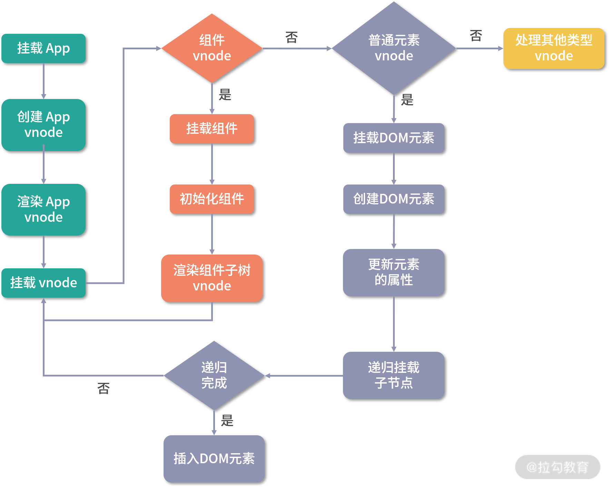

# 学习 vue.js 3.0

## vue.js 3.0 的优化

在迭代 2.x 版本的过程中，尤大发现了很多需要解决的痛点，比如源码自身的维护性，数据量大后带来的渲染和更新的性能问题，一些想舍弃但为了兼容一直保留的鸡肋 API 等；另外，尤大还希望能给开发人员带来更好的编程体验，比如更好的 TypeScript 支持、更好的逻辑复用实践等，所以他希望能从源码、性能和语法 API 三个大的方面优化框架

### 源码优化

Vue.js 3.0 ，整个源码是通过 monorepo 的方式维护的，根据功能将不同的模块拆分到 packages 目录下面不同的子目录中，对于 Vue.js 2.x 的源码组织方式，monorepo 把这些模块拆分到不同的 package 中，每个 package 有各自的 API、类型定义和测试。这样使得模块拆分更细化，职责划分更明确，模块之间的依赖关系也更加明确，开发人员也更容易阅读、理解和更改所有模块源码，提高代码的可维护性，另外一些 package（比如 reactivity 响应式库）是可以独立于 Vue.js 使用的，这样用户如果只想使用 Vue.js 3.0 的响应式能力，可以单独依赖这个响应式库而不用去依赖整个 Vue.js，减小了引用包的体积大小，而 Vue.js 2 .x 是做不到这一点的

源码的优化还体现在 Vue.js 3.0 自身采用了 TypeScript 开发， Vue.js 3.0 的时候抛弃 Flow 转而采用 TypeScript 重构了整个项目，Flow 是 Facebook 出品的 JavaScript 静态类型检查工具，它可以以非常小的成本对已有的 JavaScript 代码迁入，非常灵活，这也是 Vue.js 2.0 当初选型它时一方面的考量。但是 Flow 对于一些复杂场景类型的检查，支持得并不好。记得在看 Vue.js 2.x 源码的时候，在某行代码的注释中看到了对 Flow 的吐槽，比如在组件更新 props 的地方出现了

`const propOptions: any = vm.$options.props // wtf flow?`

由于这里 Flow 并没有正确推导出 vm.\$options.props 的类型 ，开发人员不得不强制申明 propsOptions 的类型为 any，显得很不合理

Vue.js 3.0 抛弃 Flow 后，使用 TypeScript 重构了整个项目。 TypeScript 提供了更好的类型检查，能支持复杂的类型推导；由于源码就使用 TypeScript 编写，也省去了单独维护 d.ts 文件的麻烦；就整个 TypeScript 的生态来看，TypeScript 团队也是越做越好,TypeScript 本身保持着一定频率的迭代和更新，支持的 feature 也越来越多

### 性能优化

首先是源码体积优化，我们在平时工作中也经常会尝试优化静态资源的体积，因为 JavaScript 包体积越小，意味着网络传输时间越短，JavaScript 引擎解析包的速度也越快，首先，移除一些冷门的 feature（比如 filter、inline-template 等），其次，引入 tree-shaking 的技术，减少打包体积

其次是数据劫持优化。Vue.js 区别于 React 的一大特色是它的数据是响应式的，这个特性从 Vue.js 1.x 版本就一直伴随着，这也是 Vue.js 粉喜欢 Vue.js 的原因之一，DOM 是数据的一种映射，数据发生变化后可以自动更新 DOM，用户只需要专注于数据的修改，没有其余的心智负担，Vue.js 1.x 和 Vue.js 2.x 内部都是通过 Object.defineProperty 这个 API 去劫持数据的 getter 和 setter，但这个 API 有一些缺陷，它必须预先知道要拦截的 key 是什么，所以它并不能检测对象属性的添加和删除。尽管 Vue.js 为了解决这个问题提供了 $set 和 $delete 实例方法，但是对于用户来说，还是增加了一定的心智负担，另外 Object.defineProperty 的方式还有一个问题，举个例子，比如这个嵌套层级比较深的对象，由于 Vue.js 无法判断你在运行时到底会访问到哪个属性，所以对于这样一个嵌套层级较深的对象，如果要劫持它内部深层次的对象变化，就需要递归遍历这个对象，执行 Object.defineProperty 把每一层对象数据都变成响应式的。毫无疑问，如果我们定义的响应式数据过于复杂，这就会有相当大的性能负担

**为了解决上述 2 个问题，Vue.js 3.0 使用了 Proxy API 做数据劫持**，但要注意的是，Proxy API 并不能监听到内部深层次的对象变化，因此 Vue.js 3.0 的处理方式是在 getter 中去递归响应式，这样的好处是真正访问到的内部对象才会变成响应式，而不是无脑递归，这样无疑也在很大程度上提升了性能

最后是编译优化，想优化整个 Vue.js 的运行时，除了数据劫持部分的优化，我们可以在耗时相对较多的 patch 阶段想办法，Vue.js 3.0 也是这么做的，并且它通过在编译阶段优化编译的结果，来实现运行时 patch 过程的优化，；ue.js 3.0 通过编译阶段对静态模板的分析，编译生成了 Block tree。Block tree 是一个将模版基于动态节点指令切割的嵌套区块，每个区块内部的节点结构是固定的，而且每个区块只需要以一个 Array 来追踪自身包含的动态节点。借助 Block tree，Vue.js 将 vnode 更新性能由与模版整体大小相关提升为与**动态内容的数量相关**，这是一个非常大的性能突破；Vue.js 3.0 在编译阶段还包含了对 Slot 的编译优化、事件侦听函数的缓存优化，并且在运行时重写了 diff 算法

### 语法 API 优化：Composition API

首先，是优化逻辑组织，在 Vue.js 1.x 和 2.x 版本中，编写组件本质就是在编写一个“包含了描述组件选项的对象”，我们把它称为 Options API，它的好处是在于写法非常符合直觉思维，Vue.js 3.0 提供了一种新的 API：Composition API，将某个逻辑关注点相关的代码全都放在一个函数里，这样当需要修改一个功能时，就不再需要在文件中跳来跳去

其次，是优化逻辑复用，当我们开发项目变得复杂的时候，免不了需要抽象出一些复用的逻辑。在 Vue.js 2.x 中，我们通常会用 mixins 去复用逻辑，使用单个 mixin 似乎问题不大，但是当我们一个组件混入大量不同的 mixins 的时候，会存在两个非常明显的问题：命名冲突和数据来源不清晰，首先每个 mixin 都可以定义自己的 props、data，它们之间是无感的，所以很容易定义相同的变量，导致命名冲突。另外对组件而言，如果模板中使用不在当前组件中定义的变量，那么就会不太容易知道这些变量在哪里定义的，这就是数据来源不清晰。但是 Vue.js 3.0 设计的 Composition API，就很好地帮助我们解决了 mixins 的这两个问题

Composition API 除了在逻辑复用方面有优势，也会有更好的类型支持，因为它们都是一些函数，在调用函数时，自然所有的类型就被推导出来了，不像 Options API 所有的东西使用 this。另外，Composition API 对 tree-shaking 友好，代码也更容易压缩，Composition API 属于 API 的增强，它并不是 Vue.js 3.0 组件开发的范式，如果你的组件足够简单，你还是可以使用 Options API

### 引入 RFC：使每个版本改动可控

## 组件渲染：vnode 到真实 DOM 是如何转变的

```js
// 在 Vue.js 3.0 中，初始化一个应用的方式如下
import { createApp } from "vue";
import App from "./app";
const app = createApp(App);
app.mount("#app");
```

createApp 主要做了两件事情：创建 app 对象和重写 app.mount 方法

### 创建 app 对象

首先，我们使用 ensureRenderer().createApp() 来创建 app 对象,其中 ensureRenderer() 用来创建一个渲染器对象,先用 ensureRenderer() 来延时创建渲染器，这样做的好处是当用户只依赖响应式包的时候，就不会创建渲染器，因此可以通过 tree-shaking 的方式移除核心渲染逻辑相关的代码,这里涉及了渲染器的概念，它是为跨平台渲染做准备的,可以简单地把渲染器理解为包含平台渲染核心逻辑的 JavaScript 对象

在 Vue.js 3.0 内部通过 createRenderer 创建一个渲染器，这个渲染器内部会有一个 createApp 方法，它是执行 createAppAPI 方法返回的函数，接受了 rootComponent 和 rootProps 两个参数，我们在应用层面执行 createApp(App) 方法时，会把 App 组件对象作为根组件传递给 rootComponent。这样，createApp 内部就创建了一个 app 对象，它会提供 mount 方法，这个方法是用来挂载组件的

在整个 app 对象创建过程中，Vue.js 利用闭包和函数柯里化的技巧，很好地实现了参数保留。比如，在执行 app.mount 的时候，并不需要传入渲染器 render，这是因为在执行 createAppAPI 的时候渲染器 render 参数已经被保留下来了

### 重写 app.mount 方法

根据前面的分析，我们知道 createApp 返回的 app 对象已经拥有了 mount 方法了，但在入口函数中，接下来的逻辑却是对 app.mount 方法的重写,这是因为 Vue.js 不仅仅是为 Web 平台服务，它的目标是支持跨平台渲染，而 createApp 函数内部的 app.mount 方法是一个标准的可跨平台的组件渲染流程,标准的跨平台渲染流程是先创建 vnode，再渲染 vnode。此外参数 rootContainer 也可以是不同类型的值，比如，在 Web 平台它是一个 DOM 对象，而在其他平台（比如 Weex 和小程序）中可以是其他类型的值。所以这里面的代码不应该包含任何特定平台相关的逻辑，也就是说这些代码的执行逻辑都是与平台无关的。因此我们需要在外部重写这个方法，来完善 Web 平台下的渲染逻辑

看 app.mount 重写都做了哪些事情,首先是通过 normalizeContainer 标准化容器（这里可以传字符串选择器或者 DOM 对象，但如果是字符串选择器，就需要把它转成 DOM 对象，作为最终挂载的容器），然后做一个 if 判断，如果组件对象没有定义 render 函数和 template 模板，则取容器的 innerHTML 作为组件模板内容；接着在挂载前清空容器内容，最终再调用 app.mount 的方法走标准的组件渲染流程,重写的逻辑都是和 Web 平台相关的，所以要放在外部实现。此外，这么做的目的是既能让用户在使用 API 时可以更加灵活，也兼容了 Vue.js 2.x 的写法，比如 app.mount 的第一个参数就同时支持选择器字符串和 DOM 对象两种类型

从 app.mount 开始，才算真正进入组件渲染流程,核心渲染流程做的两件事情：创建 vnode 和渲染 vnode

### 核心渲染流程,创建 vnode

Vue.js 3.0 内部还针对 vnode 的 type，做了更详尽的分类，包括 Suspense、Teleport 等，且把 vnode 的类型信息做了编码，以便在后面的 patch 阶段，可以根据不同的类型执行相应的处理逻辑,vnode 的性能一定比手动操作原生 DOM 好，这个其实是不一定的,因为，首先这种基于 vnode 实现的 MVVM 框架，在每次 render to vnode 的过程中，渲染组件会有一定的 JavaScript 耗时，特别是大组件，比如一个 1000 _ 10 的 Table 组件，render to vnode 的过程会遍历 1000 _ 10 次去创建内部 cell vnode，整个耗时就会变得比较长，加上 patch vnode 的过程也会有一定的耗时，当我们去更新组件的时候，用户会感觉到明显的卡顿。虽然 diff 算法在减少 DOM 操作方面足够优秀，但最终还是免不了操作 DOM，所以说性能并不是 vnode 的优势

Vue.js 内部是如何创建这些 vnode 的呢？

回顾 app.mount 函数的实现，内部是通过 createVNode 函数创建了根组件的 vnode,createVNode 做的事情很简单，就是：对 props 做标准化处理、对 vnode 的类型信息编码、创建 vnode 对象，标准化子节点 children 。我们现在拥有了这个 vnode 对象，接下来要做的事情就是把它渲染到页面中去

### 核心渲染流程,渲染 vnode

渲染函数 render 的实现很简单，如果它的第一个参数 vnode 为空，则执行销毁组件的逻辑，否则执行创建或者更新组件的逻辑,patch 本意是打补丁的意思，这个函数有两个功能，一个是根据 vnode 挂载 DOM，一个是根据新旧 vnode 更新 DOM,在创建的过程中，patch 函数接受多个参数，这里我们目前只重点关注前三个：第一个参数 n1 表示旧的 vnode，当 n1 为 null 的时候，表示是一次挂载的过程,第二个参数 n2 表示新的 vnode 节点，后续会根据这个 vnode 类型执行不同的处理逻辑,第三个参数 container 表示 DOM 容器，也就是 vnode 渲染生成 DOM 后，会挂载到 container 下面,对于渲染的节点，我们这里重点关注两种类型节点的渲染逻辑：对组件的处理和对普通 DOM 元素的处理

先来看对组件的处理。由于初始化渲染的是 App 组件，它是一个组件 vnode,首先是用来处理组件的 processComponent 函数,该函数的逻辑很简单，如果 n1 为 null，则执行挂载组件的逻辑，否则执行更新组件的逻辑,我们接着来看挂载组件的 mountComponent 函数,挂载组件函数 mountComponent 主要做三件事情：创建组件实例、设置组件实例、设置并运行带副作用的渲染函数

首先是**创建组件实例**，Vue.js 3.0 虽然不像 Vue.js 2.x 那样通过类的方式去实例化组件，但内部也通过对象的方式去创建了当前渲染的组件实例,其次**设置组件实例**，instance 保留了很多组件相关的数据，维护了组件的上下文，包括对 props、插槽，以及其他实例的属性的初始化处理。最后是**运行带副作用的渲染函数** setupRenderEffect,该函数利用响应式库的 effect 函数创建了一个副作用渲染函数 componentEffect,副作用，这里你可以简单地理解为，当组件的数据发生变化时，effect 函数包裹的内部渲染函数 componentEffect 会重新执行一遍，从而达到重新渲染组件的目的,渲染函数内部也会判断这是一次初始渲染还是组件更新。这里我们只分析初始渲染流程

初始渲染主要做两件事情：渲染组件生成 subTree、把 subTree 挂载到 container 中

首先，是渲染组件生成 subTree，它也是一个 vnode 对象。这里要注意别把 subTree 和 initialVNode 弄混了（其实在 Vue.js 3.0 中，根据命名我们已经能很好地区分它们了，而在 Vue.js 2.x 中它们分别命名为 \_vnode 和 \$vnode）

处理普通 DOM 元素的 processElement 函数,该函数的逻辑很简单，如果 n1 为 null，走挂载元素节点的逻辑，否则走更新元素节点逻辑,挂载元素的 mountElement 函数,挂载元素函数主要做四件事：创建 DOM 元素节点、处理 props、处理 children、挂载 DOM 元素到 container 上

首先是创建 DOM 元素节点，通过 hostCreateElement 方法创建，这是一个平台相关的方法,web 环境下，它调用了底层的 DOM API document.createElement 创建元素，所以本质上 Vue.js 强调不去操作 DOM ，只是希望用户不直接碰触 DOM，它并没有什么神奇的魔法，底层还是会操作 DOM，另外，如果是其他平台比如 Weex，hostCreateElement 方法就不再是操作 DOM ，而是平台相关的 API 了，这些平台相关的方法是在创建渲染器阶段作为参数传入的，创建完 DOM 节点后，接下来要做的是判断如果有 props 的话，给这个 DOM 节点添加相关的 class、style、event 等属性，并做相关的处理，这些逻辑都是在 hostPatchProp 函数内部做的，这里就不展开讲了

接下来是对子节点的处理，我们知道 DOM 是一棵树，vnode 同样也是一棵树，并且它和 DOM 结构是一一映射的，如果子节点是纯文本，则执行 hostSetElementText 方法，它在 Web 环境下通过设置 DOM 元素的 textContent 属性设置文本，如果子节点是数组，则执行 mountChildren 方法，子节点的挂载逻辑同样很简单，遍历 children 获取到每一个 child，然后递归执行 patch 方法挂载每一个 child 。注意，这里有对 child 做预处理的情况

mountChildren 函数的第二个参数是 container，而我们调用 mountChildren 方法传入的第二个参数是在 mountElement 时创建的 DOM 节点，这就很好地建立了父子关系，另外，通过递归 patch 这种深度优先遍历树的方式，我们就可以构造完整的 DOM 树，完成组件的渲染，处理完所有子节点后，最后通过 hostInsert 方法把创建的 DOM 元素节点挂载到 container 上，web 环境下会做一个 if 判断，如果有参考元素 anchor，就执行 parent.insertBefore ，否则执行 parent.appendChild 来把 child 添加到 parent 下，完成节点的挂载，因为 insert 的执行是在处理子节点后，所以挂载的顺序是先子节点，后父节点，最终挂载到最外层的容器上

在 mountChildren 的时候递归执行的是 patch 函数，而不是 mountElement 函数，这是因为子节点可能有其他类型的 vnode，比如组件 vnode



## 组件更新：完整的 DOM diff 流程是怎样的

件渲染的过程本质上就是把各种类型的 vnode 渲染成真实 DOM。我们也知道了组件是由模板、组件描述对象和数据构成的，数据的变化会影响组件的变化。组件的渲染过程中创建了一个带副作用的渲染函数，当数据变化的时候就会执行这个渲染函数来触发组件的更新。那么接下来，我们就具体分析一下组件的更新过程

### 副作用渲染函数更新组件的过程

带副作用渲染函数 setupRenderEffect，我们要重点关注更新组件部分的逻辑，更新组件主要做三件事情：更新组件 vnode 节点、渲染新的子树 vnode、根据新旧子树 vnode 执行 patch 逻辑

### 核心逻辑：patch 流程

首先判断新旧节点是否是相同的 vnode 类型，如果不同，比如一个 div 更新成一个 ul，那么最简单的操作就是删除旧的 div 节点，再去挂载新的 ul 节点。如果是相同的 vnode 类型，就需要走 diff 更新流程了，接着会根据不同的 vnode 类型执行不同的处理逻辑，这里我们仍然只分析普通元素类型和组件类型的处过程

#### 1. 处理组件

更新过程也是一个树的深度优先遍历过程，更新完当前节点后，就会遍历更新它的子节点，执行 processComponent，processComponent 主要通过执行 updateComponent 函数来更新子组件，updateComponent 函数在更新子组件的时候，会先执行 shouldUpdateComponent 函数，根据新旧子组件 vnode 来判断是否需要更新子组件，在 shouldUpdateComponent 函数的内部，主要是通过检测和对比组件 vnode 中的 props、chidren、dirs、transiton 等属性，来决定子组件是否需要更新

我们接着看 updateComponent 函数，如果 shouldUpdateComponent 返回 true ，那么在它的最后，先执行 invalidateJob（instance.update）避免子组件由于自身数据变化导致的重复更新，然后又执行了子组件的副作用渲染函数 instance.update 来主动触发子组件的更新

我们在更新组件的 DOM 前，需要先更新组件 vnode 节点信息，包括更改组件实例的 vnode 指针、更新 props 和更新插槽等一系列操作，因为组件在稍后执行 renderComponentRoot 时会重新渲染新的子树 vnode ，它依赖了更新后的组件 vnode 中的 props 和 slots 等数据

所以我们现在知道了一个组件重新渲染可能会有两种场景，一种是组件本身的数据变化，这种情况下 next 是 null；另一种是父组件在更新的过程中，遇到子组件节点，先判断子组件是否需要更新，如果需要则主动执行子组件的重新渲染方法，这种情况下 next 就是新的子组件 vnode

你可能还会有疑问，这个子组件对应的新的组件 vnode 是什么时候创建的呢？答案很简单，它是在父组件重新渲染的过程中，通过 renderComponentRoot 渲染子树 vnode 的时候生成，因为子树 vnode 是个树形结构，通过遍历它的子节点就可以访问到其对应的组件 vnode

所以 processComponent 处理组件 vnode，本质上就是去判断子组件是否需要更新，如果需要则递归执行子组件的副作用渲染函数来更新，否则仅仅更新一些 vnode 的属性，并让子组件实例保留对组件 vnode 的引用，用于子组件自身数据变化引起组件重新渲染的时候，在渲染函数内部可以拿到新的组件 vnode

组件是抽象的，组件的更新最终还是会落到对普通 DOM 元素的更新。所以接下来我们详细分析一下组件更新中对普通元素的处理流程

#### 2. 处理普通元素

更新元素的过程主要做两件事情：更新 props 和更新子节点。其实这是很好理解的，因为一个 DOM 节点元素就是由它自身的一些属性和子节点构成的，首先是更新 props，这里的 patchProps 函数就是在更新 DOM 节点的 class、style、event 以及其它的一些 DOM 属性

其次是更新子节点，来看一下这里的 patchChildren 函数，对于一个元素的子节点 vnode 可能会有三种情况：纯文本、vnode 数组和空。那么根据排列组合对于新旧子节点来说就有九种情况

首先来看一下旧子节点是纯文本的情况：

- 如果新子节点也是纯文本，那么做简单地文本替换即可；

- 如果新子节点是空，那么删除旧子节点即可；

- 如果新子节点是 vnode 数组，那么先把旧子节点的文本清空，再去旧子节点的父容器下添加多个新子节点。

接下来看一下旧子节点是空的情况：

- 如果新子节点是纯文本，那么在旧子节点的父容器下添加新文本节点即可；

- 如果新子节点也是空，那么什么都不需要做；

- 如果新子节点是 vnode 数组，那么直接去旧子节点的父容器下添加多个新子节点即可。

最后来看一下旧子节点是 vnode 数组的情况：

- 如果新子节点是纯文本，那么先删除旧子节点，再去旧子节点的父容器下添加新文本节点；

- 如果新子节点是空，那么删除旧子节点即可；

- 如果新子节点也是 vnode 数组，那么就需要做完整的 diff 新旧子节点了，这是最复杂的情况，内部运用了核心 diff 算法。

## 复杂的 diff 算法

新子节点数组相对于旧子节点数组的变化，无非是通过更新、删除、添加和移动节点来完成，而核心 diff 算法，就是在已知旧子节点的 DOM 结构、vnode 和新子节点的 vnode 情况下，以较低的成本完成子节点的更新为目的，求解生成新子节点 DOM 的系列操作

对于相同的节点，我们只需要做对比更新即可，所以 diff 算法的第一步从头部开始同步

### 同步头部节点

在整个 diff 的过程，我们需要维护几个变量：头部的索引 i、旧子节点的尾部索引 e1 和新子节点的尾部索引 e2，同步头部节点就是从头部开始，依次对比新节点和旧节点，如果它们相同的则执行 patch 更新节点；如果不同或者索引 i 大于索引 e1 或者 e2，则同步过程结束

### 同步尾部节点

接着从尾部开始同步尾部节点，同步尾部节点就是从尾部开始，依次对比新节点和旧节点，如果相同的则执行 patch 更新节点；如果不同或者索引 i 大于索引 e1 或者 e2，则同步过程结束

### 添加新的节点

首先要判断新子节点是否有剩余的情况，如果满足则添加新子节点，如果索引 i 大于尾部索引 e1 且 i 小于 e2，那么从索引 i 开始到索引 e2 之间，我们直接挂载新子树这部分的节点

### 删除多余节点

如果不满足添加新节点的情况，我就要接着判断旧子节点是否有剩余，如果满足则删除旧子节点，如果索引 i 大于尾部索引 e2，那么从索引 i 开始到索引 e1 之间，我们直接删除旧子树这部分的节点。

### 处理未知子序列

单纯的添加和删除节点都是比较理想的情况，操作起来也很容易，但是有些时候并非这么幸运，我们会遇到比较复杂的未知子序列，这时候 diff 算法会怎么做呢

其实无论多复杂的情况，最终无非都是通过更新、删除、添加、移动这些动作来操作节点，而我们要做的就是找到相对优的解,当两个节点类型相同时，我们执行更新操作；当新子节点中没有旧子节点中的某些节点时，我们执行删除操作；当新子节点中多了旧子节点中没有的节点时，我们执行添加操作，这些操作我们在前面已经阐述清楚了。相对来说这些操作中最麻烦的就是移动，我们既要判断哪些节点需要移动也要清楚如何移动

#### 移动子节点

那么什么时候需要移动呢，就是当子节点排列顺序发生变化的时候

```js
var prev = [1, 2, 3, 4, 5, 6];
var next = [1, 3, 2, 6, 4, 5];
```

可以看到，从 prev 变成 next，数组里的一些元素的顺序发生了变化，我们可以把子节点类比为元素，现在问题就简化为我们如何用最少的移动使元素顺序从 prev 变化为 next ,一种思路是在 next 中找到一个递增子序列，比如 [1, 3, 6] 、[1, 2, 4, 5]。之后对 next 数组进行倒序遍历，移动所有不在递增序列中的元素即可,递增子序列越长，所需要移动元素的次数越少，所以如何移动的问题就回到了求解最长递增子序列的问题

我们现在要做的是在新旧子节点序列中找出相同节点并更新，找出多余的节点删除，找出新的节点添加，找出是否有需要移动的节点，如果有该如何移动,在查找过程中需要对比新旧子序列，那么我们就要遍历某个序列，如果在遍历旧子序列的过程中需要判断某个节点是否在新子序列中存在，这就需要双重循环，而双重循环的复杂度是 O(n2) ，为了优化这个复杂度，我们可以用一种空间换时间的思路，建立索引图，把时间复杂度降低到 O(n)。\*\*\*\*

#### 建立索引图

通常我们在开发过程中， 会给 v-for 生成的列表中的每一项分配唯一 key 作为项的唯一 ID，这个 key 在 diff 过程中起到很关键的作用。对于新旧子序列中的节点，我们认为 key 相同的就是同一个节点，直接执行 patch 更新即可

#### 更新和移除旧节点

接下来，我们就需要遍历旧子序列，有相同的节点就通过 patch 更新，并且移除那些不在新子序列中的节点，同时找出是否有需要移动的节点

我们建立了一个 newIndexToOldIndexMap 的数组，来存储新子序列节点的索引和旧子序列节点的索引之间的映射关系，用于确定最长递增子序列，这个数组的长度为新子序列的长度，每个元素的初始值设为 0， 它是一个特殊的值，如果遍历完了仍有元素的值为 0，则说明遍历旧子序列的过程中没有处理过这个节点，这个节点是新添加的

下面我们说说具体的操作过程：正序遍历旧子序列，根据前面建立的 keyToNewIndexMap(一个 map) 查找旧子序列中的节点在新子序列中的索引，如果找不到就说明新子序列中没有该节点，就删除它；如果找得到则将它在旧子序列中的索引更新到 newIndexToOldIndexMap 中

遍历过程中，我们用变量 maxNewIndexSoFar 跟踪判断节点是否移动，maxNewIndexSoFar 始终存储的是上次求值的 newIndex，一旦本次求值的 newIndex 小于 maxNewIndexSoFar，这说明顺序遍历旧子序列的节点在新子序列中的索引并不是一直递增的，也就说明存在移动的情况，除此之外，这个过程中我们也会更新新旧子序列中匹配的节点，另外如果所有新的子序列节点都已经更新，而对旧子序列遍历还未结束，说明剩余的节点就是多余的，删除即可

至此，我们完成了新旧子序列节点的更新、多余旧节点的删除，并且建立了一个 newIndexToOldIndexMap 存储新子序列节点的索引和旧子序列节点的索引之间的映射关系，并确定是否有移动

#### 移动和挂载新节点

接下来，就到了处理未知子序列的最后一个流程，移动和挂载新节点，我们前面已经判断了是否移动，如果 moved 为 true 就通过 getSequence(newIndexToOldIndexMap) 计算最长递增子序列

接着我们采用倒序的方式遍历新子序列，因为倒序遍历可以方便我们使用最后更新的节点作为锚点。在倒序的过程中，锚点指向上一个更新的节点，然后判断 `newIndexToOldIndexMap[i]` 是否为 0，如果是则表示这是新节点，就需要挂载它；接着判断是否存在节点移动的情况，如果存在的话则看节点的索引是不是在最长递增子序列中，如果在则倒序最长递增子序列，否则把它移动到锚点的前面

新子序列倒序完成，即完成了新节点的插入和旧节点的移动操作，也就完成了整个核心 diff 算法对节点的更新

至此，我们就在已知旧子节点 DOM 结构和 vnode、新子节点 vnode 的情况下，求解出生成新子节点的 DOM 的更新、移动、删除、新增等系列操作，并且以一种较小成本的方式完成 DOM 更新,我们知道了子节点更新调用的是 patch 方法， Vue.js 正是通过这种递归的方式完成了整个组件树的更新。核心 diff 算法中最复杂就是求解最长递增子序列，下面我们再来详细学习一下这个算法

#### 最长递增子序列

求解最长递增子序列是一道经典的算法题，多数解法是使用动态规划的思想，算法的时间复杂度是 O(n2)，而 Vue.js 内部使用的是维基百科提供的一套“贪心 + 二分查找”的算法，贪心算法的时间复杂度是 O(n)，二分查找的时间复杂度是 O(logn)，所以它的总时间复杂度是 O(nlogn)

这个算法的主要思路：对数组遍历，依次求解长度为 i 时的最长递增子序列，当 i 元素大于 i - 1 的元素时，添加 i 元素并更新最长子序列；否则往前查找直到找到一个比 i 小的元素，然后插在该元素后面并更新对应的最长递增子序列,这种做法的主要目的是让递增序列的差尽可能的小，从而可以获得更长的递增子序列，这便是一种贪心算法的思想

Vue.js 3 在 diff 算法上和 Vue.js 2.x 已经不一样了，Vue.js 2.x 的 diff 算法是双端比较法 ,Vue 3 diff 算法的主要优势是设计了 Block 的概念，在编译阶段对静态模板分析，生成 Block tree，收集动态更新的节点，然后在 patch 阶段就可以只比对 Block tree 中的节点，达到提升 diff 性能的目的,而核心 diff 算法，也就是去头尾的最长递增子序列算法和双端比较算法就性能而言差别并不大。

## 逻辑复用:Composition API

Vue.js 3.0 设计了一个很强大的 API —— Composition API，它主要用来优化代码逻辑的组织和复用。

从语法上看，它提供了一个 setup 启动函数作为逻辑组织的入口，暴露了响应式 API 为用户所用，也提供了生命周期函数以及依赖注入的接口，这让我们不依托于 Options API 也可以完成一个组件的开发，并且更有利于代码逻辑的组织和复用,但是我们要明确一点，Composition API 属于 API 的增强，它并不是 Vue.js 3.0 组件开发的范式，如果你的组件足够简单，你还是可以使用 Options API

了解了 Composition API 的应用场景和使用方式后，我们需要进一步思考，这样一套 API 是如何设计出来的？它是怎么和组件配合的？在组件整个渲染过程中它又做了哪些事情？

## Setup：组件渲染前的初始化过程是怎样的？

Vue.js 3.0 允许我们在编写组件的时候添加一个 setup 启动函数，它是 Composition API 逻辑组织的入口

我们先来回想一下 Vue.js 2.x 编写组件的时候，会在 props、data、methods、computed 等 options 中定义一些变量。在组件初始化阶段，Vue.js 内部会处理这些 options，即把定义的变量添加到了组件实例上。等模板编译成 render 函数的时候，内部通过 with(this){} 的语法去访问在组件实例中的变量

那么到了 Vue.js 3.0，既支持组件定义 setup 函数，而且在模板 render 的时候，又可以访问到 setup 函数返回的值，这是如何实现的？我们来一探究竟

### 创建和设置组件实例

我们来回顾一下组件的渲染流程：创建 vnode 、渲染 vnode 和生成 DOM,其中渲染 vnode 的过程主要就是在挂载组件,挂载组件的代码主要做了三件事情：创建组件实例、设置组件实例和设置并运行带副作用的渲染函数,前两个流程就跟我们这里提到的问题息息相关

先看创建组件实例的流程，我们要关注 createComponentInstance 方法的实现，组件实例 instance 上定义了很多属性，你千万不要被这茫茫多的属性吓到，因为其中一些属性是为了实现某个场景或者某个功能所定义的，Vue.js 2.x 使用 new Vue 来初始化一个组件的实例，到了 Vue.js 3.0，我们直接通过创建对象去创建组件的实例。这两种方式并无本质的区别，都是引用一个对象，在整个组件的生命周期中去维护组件的状态数据和上下文环境，创建好 instance 实例后，接下来就是设置它的一些属性。目前已完成了组件的上下文、根组件指针以及派发事件方法的设置。我们在后面会继续分析更多 instance 实例属性的设置逻辑

接着是组件实例的设置流程，对 setup 函数的处理就在这里完成，我们来看一下 setupComponent 方法的实现，我们从组件 vnode 中获取了 props、children、shapeFlag 等属性，然后分别对 props 和插槽进行初始化，这两部分逻辑在后续的章节再详细分析。根据 shapeFlag 的值，我们可以判断这是不是一个有状态组件，如果是则要进一步去设置有状态组件的实例，接下来我们要关注到 setupStatefulComponent 函数，它主要做了三件事：创建渲染上下文代理、判断处理 setup 函数和完成组件实例设置

### 创建渲染上下文代理

首先是创建渲染上下文代理的流程，它主要对 instance.ctx 做了代理。在分析实现前，我们需要思考一个问题，这里为什么需要代理呢？其实在 Vue.js 2.x 中，也有类似的数据代理逻辑，比如 props 求值后的数据，实际上存储在 this.\_props 上，而 data 中定义的数据存储在 this.\_data 上，在初始化组件的时候，data 中定义的 msg 在组件内部是存储在 this.\_data 上的，而模板渲染的时候访问 this.msg，实际上访问的是 this.\_data.msg，这是因为 Vue.js 2.x 在初始化 data 的时候，做了一层 proxy 代理，到了 Vue.js 3.0，为了方便维护，我们把组件中不同状态的数据存储到不同的属性中，比如存储到 setupState、ctx、data、props 中。我们在执行组件渲染函数的时候，为了方便用户使用，会直接访问渲染上下文 instance.ctx 中的属性，所以我们也要做一层 proxy，对渲染上下文 instance.ctx 属性的访问和修改，代理到对 setupState、ctx、data、props 中的数据的访问和修改

明确了代理的需求后，我们接下来就要分析 proxy 的几个方法： get、set 和 has 当我们访问 instance.ctx 渲染上下文中的属性时，就会进入 get 函数。

函数首先判断 key 不以 $ 开头的情况，这部分数据可能是 setupState、data、props、ctx 中的一种，其中 data、props 我们已经很熟悉了；setupState 就是 setup 函数返回的数据，如果 key 不以 $ 开头，那么就依次判断 setupState、data、props、ctx 中是否包含这个 key，如果包含就返回对应值。注意这个判断顺序很重要，在 key 相同时它会决定数据获取的优先级，我们可以看到这里定义了 accessCache 作为渲染代理的属性访问缓存，它具体是干什么的呢？组件在渲染时会经常访问数据进而触发 get 函数，这其中最昂贵的部分就是多次调用 hasOwn 去判断 key 在不在某个类型的数据中，但是在普通对象上执行简单的属性访问相对要快得多。所以在第一次获取 key 对应的数据后，我们利用 `accessCache[key] `去缓存数据，下一次再次根据 key 查找数据，我们就可以直接通过 `accessCache[key] `获取对应的值，就不需要依次调用 hasOwn 去判断了。这也是一个性能优化的小技巧,如果 key 以 $ 开头，那么接下来又会有一系列的判断，首先判断是不是 Vue.js 内部公开的 $xxx 属性或方法（比如 $parent）；然后判断是不是 vue-loader 编译注入的 css 模块内部的 key；接着判断是不是用户自定义以 $ 开头的 key；最后判断是不是全局属性。如果都不满足，就剩两种情况了，即在非生产环境下就会报两种类型的警告，第一种是在 data 中定义的数据以 $ 开头的警告，因为 $ 是保留字符，不会做代理；第二种是在模板中使用的变量没有定义的警告

接下来是 set 代理过程，当我们修改 instance.ctx 渲染上下文中的属性的时候，就会进入 set 函数。我们来看一下 set 函数的实现,函数主要做的事情就是对渲染上下文 instance.ctx 中的属性赋值，它实际上是代理到对应的数据类型中去完成赋值操作的。这里仍然要注意顺序问题，和 get 一样，优先判断 setupState，然后是 data，接着是 props

最后是 has 代理过程，当我们判断属性是否存在于 instance.ctx 渲染上下文中时，就会进入 has 函数，这个在平时项目中用的比较少，同样来举个例子，当执行 created 钩子函数中的 'msg' in this 时，就会触发 has 函数,这个函数的实现很简单，依次判断 key 是否存在于 accessCache、data、setupState、props 、用户数据、公开属性以及全局属性中，然后返回结果。

至此，我们就搞清楚了创建上下文代理的过程，让我们回到 setupStatefulComponent 函数中，接下来分析第二个流程——判断处理 setup 函数

### 判断处理 setup 函数

如果我们在组件中定义了 setup 函数，接下来就是处理 setup 函数的流程，主要是三个步骤：创建 setup 函数上下文、执行 setup 函数并获取结果和处理 setup 函数的执行结果。接下来我们就逐个来分析

首先判断 setup 函数的参数长度，如果大于 1，则创建 setupContext 上下文,setupContext 对应的就是 setup 函数第二个参数

我们接下来看一下 setup 函数具体是如何执行的,它其实就是对 fn 做的一层包装，内部还是执行了 fn，并在有参数的时候传入参数，所以 setup 的第一个参数是 instance.props，第二个参数是 setupContext。函数执行过程中如果有 JavaScript 执行错误就会捕获错误，并执行 handleError 函数来处理,执行 setup 函数并拿到了返回的结果，那么接下来就要用 handleSetupResult 函数来处理结果,我们详细看一下 handleSetupResult 函数的实现

可以看到，当 setupResult 是一个对象的时候，我们把它变成了响应式并赋值给 instance.setupState，这样在模板渲染的时候，依据前面的代理规则，instance.ctx 就可以从 instance.setupState 上获取到对应的数据，这就在 setup 函数与模板渲染间建立了联系

另外 setup 不仅仅支持返回一个对象，也可以返回一个函数作为组件的渲染函数

在 handleSetupResult 的最后，会执行 finishComponentSetup 函数完成组件实例的设置，其实这个函数和 setup 函数的执行结果已经没什么关系了，提取到外面放在 handleSetupResult 函数后面执行更合理一些。另外当组件没有定义的 setup 的时候，也会执行 finishComponentSetup 函数去完成组件实例的设置

### 完成组件实例设置

接下来我们来看一下 finishComponentSetup 函数的实现,函数主要做了两件事情：标准化模板或者渲染函数和兼容 Options API。接下来我们详细分析这两个流程

#### 标准化模板或者渲染函数

因此 Vue.js 在 Web 端有两个版本：runtime-only 和 runtime-compiled。我们更推荐用 runtime-only 版本的 Vue.js，因为相对而言它体积更小，而且在运行时不用编译，不仅耗时更少而且性能更优秀。遇到一些不得已的情况比如上述提到的古老项目，我们也可以选择 runtime-compiled 版本,runtime-only 和 runtime-compiled 的主要区别在于是否注册了这个 compile 方法,在 Vue.js 3.0 中，compile 方法是通过外部注册的

回到标准化模板或者渲染函数逻辑，我们先看 instance.render 是否存在，如果不存在则开始标准化流程，这里主要需要处理以下三种情况。

- compile 和组件 template 属性存在，render 方法不存在的情况。此时， runtime-compiled 版本会在 JavaScript 运行时进行模板编译，生成 render 函数。

- compile 和 render 方法不存在，组件 template 属性存在的情况。此时由于没有 compile，这里用的是 runtime-only 的版本，因此要报一个警告来告诉用户，想要运行时编译得使用 runtime-compiled 版本的 Vue.js。

- 组件既没有写 render 函数，也没有写 template 模板，此时要报一个警告，告诉用户组件缺少了 render 函数或者 template 模板。

处理完以上情况后，就要把组件的 render 函数赋值给 instance.render。到了组件渲染的时候，就可以运行 instance.render 函数生成组件的子树 vnode 了

另外对于使用 with 块运行时编译的渲染函数，渲染上下文的代理是 RuntimeCompiledPublicInstanceProxyHandlers，它是在之前渲染上下文代理 PublicInstanceProxyHandlers 的基础上进行的扩展，主要对 has 函数的实现做了优化

这里如果 key 以 \_ 开头，或者 key 在全局变量的白名单内，则 has 为 false，此时则直接命中警告，不用再进行之前那一系列的判断了

#### Options API：兼容 Vue.js 2.x

我们知道 Vue.js 2.x 是通过组件对象的方式去描述一个组件，之前我们也说过，Vue.js 3.0 仍然支持 Vue.js 2.x Options API 的写法，这主要就是通过 applyOptions 方法实现的

## 响应式：响应式内部的实现原理是怎样的：收集依赖

除了组件化，Vue.js 另一个核心设计思想就是响应式。它的本质是当数据变化后会自动执行某个函数，映射到组件的实现就是，当数据变化后，会自动触发组件的重新渲染。响应式是 Vue.js 组件化更新渲染的一个核心机制

在介绍 Vue.js 3.0 响应式实现之前，我们先来回顾一下 Vue.js 2.x 响应式实现的部分： 它在内部通过 Object.defineProperty API 劫持数据的变化，在数据被访问的时候收集依赖，然后在数据被修改的时候通知依赖更新，在 Vue.js 2.x 中，Watcher 就是依赖，有专门针对组件渲染的 render watcher

Object.defineProperty API 的一些缺点：不能监听对象属性新增和删除；初始化阶段递归执行 Object.defineProperty 带来的性能负担，Vue.js 3.0 为了解决 Object.defineProperty 的这些缺陷，使用 Proxy API 重写了响应式部分，并独立维护和发布整个 reactivity 库

### 响应式对象的实现差异

在 Vue.js 2.x 中构建组件时，只要我们在 data、props、computed 中定义数据，那么它就是响应式的，在 data 中定义数据最终也是挂载到组件实例 this 上，这和我直接在 created 钩子函数通过 this.xxx 定义的数据唯一区别就是，在 data 中定义的数据是响应式的，我们在 created 中定义的 this.msg 并不是响应式对象，所以 Vue.js 内部不会对它做额外的处理。而 data 中定义的数据，Vue.js 内部在组件初始化的过程中会把它变成响应式，这是一个相对黑盒的过程，用户通常不会感知到

在一些场景下，如果我们仅仅想在组件上下文中共享某个变量，而不必去监测它的变化，这时就特别适合在 created 钩子函数中去定义这个变量，因为创建响应式的过程是有性能代价的，这相当于一种 Vue.js 应用的性能优化小技巧，你掌握了这一点就可以在合适的场景中应用了，到了 Vue.js 3.0 构建组件时，你可以不依赖于 Options API，而使用 Composition API 去编写，Composition API 更推荐用户主动定义响应式对象，而非内部的黑盒处理。这样用户可以更加明确哪些数据是响应式的，如果你不想让数据变成响应式，就定义成它的原始数据类型即可

也就是在 Vue.js 3.0 中，我们用 reactive 这个有魔力的函数，把数据变成了响应式，那么它内部到底是怎么实现的呢？我们接下来一探究竟

### Reactive API

reactive 内部通过 createReactiveObject 函数把 target 变成了一个响应式对象，在这个过程中，createReactiveObject 函数主要做了以下几件事情：1.函数首先判断 target 是不是数组或者对象类型，如果不是则直接返回。所以原始数据 target 必须是对象或者数组，2.如果对一个已经是响应式的对象再次执行 reactive，还应该返回这个响应式对象，3.如果对同一个原始数据多次执行 reactive ，那么会返回相同的响应式对象，4.使用 canObserve 函数对 target 对象做一进步限制

2.可以看到 observed 已经是响应式结果了，如果对它再去执行 reactive，返回的值 observed2 和 observed 还是同一个对象引，因为这里 reactive 函数会通过 target.**v_raw 属性来判断 target 是否已经是一个响应式对象（因为响应式对象的 **v_raw 属性会指向它自身，后面会提到），如果是的话则直接返回响应式对象

3.可以看到，原始数据 original 被反复执行 reactive，但是响应式结果 observed 和 observed2 是同一个对象，所以这里 reactive 函数会通过 target.**v_reactive 判断 target 是否已经有对应的响应式对象（因为创建完响应式对象后，会给原始对象打上 **v_reactive 标识，后面会提到），如果有则返回这个响应式对象

4.比如，带有 \_\_v_skip 属性的对象、被冻结的对象，以及不在白名单内的对象如 Date 类型的对象实例是不能变成响应式的

5.通过 Proxy API 劫持 target 对象，把它变成响应式。我们把 Proxy 函数返回的结果称作响应式对象，这里 Proxy 对应的处理器对象会根据数据类型的不同而不同，我们稍后会重点分析基本数据类型的 Proxy 处理器对象，reactive 函数传入的 baseHandlers 值是 mutableHandler

6.给原始数据打个标识，这就是前面“对同一个原始数据多次执行 reactive ，那么会返回相同的响应式对象”逻辑的判断依据

仔细想想看，响应式的实现方式无非就是劫持数据，Vue.js 3.0 的 reactive API 就是通过 Proxy 劫持数据，而且由于 Proxy 劫持的是整个对象，所以我们可以检测到任何对对象的修改，弥补了 Object.defineProperty API 的不足

接下来，我们继续看 Proxy 处理器对象 mutableHandlers 的实现，它其实就是劫持了我们对 observed 对象的一些操作，比如

- 访问对象属性会触发 get 函数；
- 设置对象属性会触发 set 函数；
- 删除对象属性会触发 deleteProperty 函数；
- in 操作符会触发 has 函数；
- 通过 Object.getOwnPropertyNames 访问对象属性名会触发 ownKeys 函数。

因为无论命中哪个处理器函数，它都会做依赖收集和派发通知这两件事其中的一个，所以这里我只要分析常用的 get 和 set 函数就可以了

### 依赖收集：get 函数

依赖收集发生在数据访问的阶段，由于我们用 Proxy API 劫持了数据对象，所以当这个响应式对象属性被访问的时候就会执行 get 函数，我们来看一下 get 函数的实现，其实它是执行 createGetter 函数的返回值，为了分析主要流程，省略 get 函数中的一些分支逻辑，isReadonly 也默认为 false

get 函数主要做了四件事情，**首先对特殊的 key 做了代理**，这就是为什么我们在 createReactiveObject 函数中判断响应式对象是否存在 \_\_v_raw 属性，如果存在就返回这个响应式对象本身，**接着通过 Reflect.get 方法求值**，如果 target 是数组且 key 命中了 arrayInstrumentations，则执行对应的函数，我们可以大概看一下 arrayInstrumentations 的实现，也就是说，当 target 是一个数组的时候，我们去访问 target.includes、target.indexOf 或者 target.lastIndexOf 就会执行 arrayInstrumentations 代理的函数，除了调用数组本身的方法求值外，还对数组每个元素做了依赖收集。因为一旦数组的元素被修改，数组的这几个 API 的返回结果都可能发生变化，所以我们需要跟踪数组每个元素的变化，回到 get 函数，**第三步就是通过 Reflect.get 求值**，然后会执行 track 函数收集依赖，我们稍后重点分析这个过程

函数最后会对计算的值 res 进行判断，如果它也是数组或对象，则递归执行 reactive 把 res 变成响应式对象。这么做是因为 Proxy 劫持的是对象本身，并不能劫持子对象的变化，这点和 Object.defineProperty API 一致。但是 Object.defineProperty 是在初始化阶段，即定义劫持对象的时候就已经递归执行了，而 Proxy 是在对象属性被访问的时候才递归执行下一步 reactive，这其实是一种延时定义子对象响应式的实现，在性能上会有较大的提升

整个 get 函数最核心的部分其实是执行 track 函数收集依赖，下面我们重点分析这个过程，分析这个函数的实现前，我们先想一下要收集的依赖是什么，我们的目的是实现响应式，就是当数据变化的时候可以自动做一些事情，比如执行某些函数，所以我们收集的依赖就是数据变化后执行的副作用函数

再来看实现，我们把 target 作为原始的数据，key 作为访问的属性。我们创建了全局的 targetMap 作为原始数据对象的 Map，它的键是 target，值是 depsMap，作为依赖的 Map；这个 depsMap 的键是 target 的 key，值是 dep 集合，dep 集合中存储的是依赖的副作用函数

所以每次 track ，就是把当前激活的副作用函数 activeEffect 作为依赖，然后收集到 target 相关的 depsMap 对应 key 下的依赖集合 dep 中

## 响应式：响应式内部的实现原理是怎样的：派发更新

### reactive API

#### 派发通知：set 函数

派发通知发生在数据更新的阶段 ，由于我们用 Proxy API 劫持了数据对象，所以当这个响应式对象属性更新的时候就会执行 set 函数。我们来看一下 set 函数的实现，它是执行 createSetter **函数的返回值**,set 函数的实现逻辑很简单，主要就做两件事情， 首先通过 Reflect.set 求值 ， 然后通过 trigger 函数派发通知 ，并依据 key 是否存在于 target 上来确定通知类型，即新增还是修改,整个 set 函数最核心的部分就是 执行 trigger 函数派发通知 ，下面我们将重点分析这个过程。

我们先来看一下 trigger 函数的实现，为了分析主要流程，省略 trigger 函数中的一些分支逻辑,trigger 函数的实现也很简单，主要做了四件事情

- 通过 targetMap 拿到 target 对应的依赖集合 depsMap；
- 创建运行的 effects 集合；
- 根据 key 从 depsMap 中找到对应的 effects 添加到 effects 集合；
- 遍历 effects 执行相关的副作用函数。

所以每次 trigger 函数就是根据 target 和 key ，从 targetMap 中找到相关的所有副作用函数遍历执行一遍

在描述依赖收集和派发通知的过程中，我们都提到了一个词：副作用函数，依赖收集过程中我们把 activeEffect（当前激活副作用函数）作为依赖收集，它又是什么？接下来我们来看一下副作用函数的庐山真面目

#### 副作用函数

```js
import { reactive } from "vue";
const counter = reactive({
  num: 0,
});
function logCount() {
  console.log(counter.num);
}
function count() {
  counter.num++;
}
logCount();
count();
```

可以看到，这里我们定义了响应式对象 counter，然后我们在 logCount 中访问了 counter.num，我们希望通过执行 count 函数修改 counter.num 值的时候，能自动执行 logCount 函数。

按我们之前对依赖收集过程的分析，如果这个 logCount 就是 activeEffect 的话，那么就可以实现需求，但显然是做不到的，因为代码在执行到 console.log(counter.num)这一行 的时候，它对自己在 logCount 函数中的运行是一无所知的

其实只要我们运行 logCount 函数前，把 logCount 赋值给 activeEffect 就好了，如下：

```js
activeEffect = logCount;
logCount();
```

顺着这个思路，我们可以利用高阶函数的思想，对 logCount 做一层封装

```js
function wrapper(fn) {
  const wrapped = function (...args) {
    activeEffect = fn;
    fn(...args);
  };
  return wrapped;
}
const wrappedLog = wrapper(logCount);
wrappedLog();
```

这里，wrapper 本身也是一个函数，它接受 fn 作为参数，返回一个新的函数 wrapped，然后维护一个全局的 activeEffect，当 wrapped 执行的时候，把 activeEffect 设置为 fn，然后执行 fn 即可。这样当我们执行 wrappedLog 后，再去修改 counter.num，就会自动执行 logCount 函数了,实际上 Vue.js 3.0 就是采用类似的做法，在它内部就有一个 effect 副作用函数，我们来看一下它的实现

effect 内部通过执行 createReactiveEffect 函数去创建一个新的 effect 函数，为了和外部的 effect 函数区分，我们把它称作 reactiveEffect 函数，并且还给它添加了一些额外属性（我在注释中都有标明）。另外，effect 函数还支持传入一个配置参数以支持更多的 feature

这个 reactiveEffect 函数就是响应式的副作用函数，当执行 trigger 过程派发通知的时候，执行的 effect 就是它,按我们之前的分析，这个 reactiveEffect 函数只需要做两件事情： 把全局的 activeEffect 指向它 ， 然后执行被包装的原始函数 fn 即可,但实际上它的实现要更复杂一些，首先它会判断 effect 的状态是否是 active，这其实是一种控制手段，允许在非 active 状态且非调度执行情况，则直接执行原始函数 fn 并返回，在后续学习完侦听器后你会对它的理解更加深刻

接着判断 effectStack 中是否包含 effect，如果没有就把 effect 压入栈内。之前我们提到，只要设置 activeEffect = effect 即可，那么这里为什么要设计一个栈的结构呢,其实是考虑到嵌套 effect 的场景

针对嵌套 effect 的场景，我们不能简单地赋值 activeEffect，应该考虑到函数的执行本身就是一种入栈出栈操作，因此我们也可以设计一个 effectStack，这样每次进入 reactiveEffect 函数就先把它入栈，然后 activeEffect 指向这个 reactiveEffect 函数，接着在 fn 执行完毕后出栈，再把 activeEffect 指向 effectStack 最后一个元素，也就是外层 effect 函数对应的 reactiveEffect

这里我们还注意到一个细节，在入栈前会执行 cleanup 函数清空 reactiveEffect 函数对应的依赖 。在执行 track 函数的时候，除了收集当前激活的 effect 作为依赖，还通过 activeEffect.deps.push(dep) 把 dep 作为 activeEffect 的依赖，这样在 cleanup 的时候我们就可以找到 effect 对应的 dep 了，然后把 effect 从这些 dep 中删除

为什么需要 cleanup 呢？`vue3-learn\vue3-cli\vite-vue3\src\components\Clean.vue`,结合代码可以知道，这个组件的视图会根据 showMsg 变量的控制显示 msg 或者一个随机数，当我们点击 Switch View 的按钮时，就会修改这个变量值,假设没有 cleanup，在第一次渲染模板的时候，activeEffect 是组件的副作用渲染函数，因为模板 render 的时候访问了 state.msg，所以会执行依赖收集，把副作用渲染函数作为 state.msg 的依赖，我们把它称作 render effect。然后我们点击 Switch View 按钮，视图切换为显示随机数，此时我们再点击 Toggle Msg 按钮，由于修改了 state.msg 就会派发通知，找到了 render effect 并执行，就又触发了组件的重新渲染,但这个行为实际上并不符合预期，因为当我们点击 Switch View 按钮，视图切换为显示随机数的时候，也会触发组件的重新渲染，但这个时候视图并没有渲染 state.msg，所以对它的改动并不应该影响组件的重新渲染,因此在组件的 render effect 执行之前，如果通过 cleanup 清理依赖，我们就可以删除之前 state.msg 收集的 render effect 依赖。这样当我们修改 state.msg 时，由于已经没有依赖了就不会触发组件的重新渲染，符合预期

至此，我们从 reactive API 入手了解了整个响应式对象的实现原理。除了 reactive API，Vue.js 3.0 还提供了其他好用的响应式 API，接下来我们一起分析一些常用的

### readonly API

如果用 const 声明一个对象变量，虽然不能直接对这个变量赋值，但我们可以修改它的属。如果我们希望创建只读对象，不能修改它的属性，也不能给这个对象添加和删除属性，让它变成一个真正意义上的只读对象,显然，想实现上述需求就需要劫持对象，于是 Vue.js 3.0 在 reactive API 的基础上，设计并实现了 readonly API

其实 readonly 和 reactive 函数的主要区别，就是执行 createReactiveObject 函数时的参数 isReadonly 不同,首先 isReadonly 变量为 true，所以在创建过程中会给原始对象 target 打上一个 \_\_v_readonly 的标识。另外还有一个特殊情况，如果 target 已经是一个 reactive 对象，就会把它继续变成一个 readonly 响应式对象,其次就是 baseHandlers 的 collectionHandlers 的区别，我们这里仍然只关心基本数据类型的 Proxy 处理器对象，readonly 函数传入的 baseHandlers 值是 readonlyHandlers,readonlyHandlers 和 mutableHandlers 的区别主要在 get、set 和 deleteProperty 三个函数上。很显然，作为一个只读的响应式对象，是不允许修改属性以及删除属性的，所以在非生产环境下 set 和 deleteProperty 函数的实现都会报警告，提示用户 target 是 readonly 的

接下来我们来看一下其中 readonlyGet 的实现，它其实就是 createGetter(true) 的返回值,它和 reactive API 最大的区别就是不做依赖收集了，这一点也非常好理解，因为它的属性不会被修改，所以就不用跟踪它的变化了。

到这里，readonly API 就介绍完了，接下来我们分析一下另一个常用的响应式 API：ref

### ref API

通过前面的分析，我们知道 reactive API 对传入的 target 类型有限制，必须是对象或者数组类型，而对于一些基础类型（比如 String、Number、Boolean）是不支持的。但是有时候从需求上来说，可能我只希望把一个字符串变成响应式，却不得不封装成一个对象，这样使用上多少有一些不方便，于是 Vue.js 3.0 设计并实现了 ref API

ref 的实现:函数首先处理了嵌套 ref 的情况，如果传入的 rawValue 也是 ref，那么直接返回,接着对 rawValue 做了一层转换，如果 rawValue 是对象或者数组类型，那么把它转换成一个 reactive 对象,最后定义一个对 value 属性做 getter 和 setter 劫持的对象并返回，get 部分就是执行 track 函数做依赖收集然后返回它的值；set 部分就是设置新值并且执行 trigger 函数派发通知

其实 Vue.js 3.0 在响应式的实现思路和 Vue.js 2.x 差别并不大，主要就是 劫持数据的方式改成用 **Proxy 实现** ， 以及收集的依赖由 watcher 实例变成了组件**副作用渲染函数**

## 计算属性：计算属性比普通函数好在哪里

### 计算属性 API： computed

使用看代码

我们现在已经知道了 computed API 的两种使用方式了，接下来就看看它是怎样实现的，computed 函数的流程主要做了三件事情：标准化参数，创建副作用函数和创建 computed 对象。我们来详细分析一下这几个步骤

首先是标准化参数。computed 函数接受两种类型的参数，一个是 getter 函数，一个是拥有 getter 和 setter 函数的对象，通过判断参数的类型，我们初始化了函数内部定义的 getter 和 setter 函数

接着是创建副作用函数 runner。computed 内部通过 effect 创建了一个副作用函数，它是对 getter 函数做的一层封装，另外我们这里要注意第二个参数，也就是 effect 函数的配置对象。其中 lazy 为 true 表示 effect 函数返回的 runner 并不会立即执行；computed 为 true 用于表示这是一个 computed effect，用于 trigger 阶段的优先级排序，我们稍后会分析；scheduler 表示它的调度运行的方式，我们也稍后分析

最后是创建 computed 对象并返回，这个对象也拥有 getter 和 setter 函数。当 computed 对象被访问的时候会触发 getter，然后会判断是否 dirty，如果是就执行 runner，然后做依赖收集；当我们直接设置 computed 对象时会触发 setter，即执行 computed 函数内部定义的 setter 函数

### 计算属性的运行机制

computed 函数的逻辑会有一点绕，不过不要紧，我们可以结合一个应用 computed 计算属性的例子，来理解整个计算属性的运行机制。分析之前我们需要记住 computed 内部两个重要的变量，第一个 dirty 表示一个计算属性的值是否是“脏的”，用来判断需不需要重新计算，第二个 value 表示计算属性每次计算后的结果

computed API 内部创建副作用函数时，已经配置了 scheduler 函数

```js
scheduler: () => {
  if (!dirty) {
    dirty = true;
    // 派发通知，通知运行访问该计算属性的 activeEffect
    trigger(computed, "set" /* SET */, "value");
  }
};
```

它并没有对计算属性求新值，而仅仅是把 dirty 设置为 true，再执行 trigger(computed, "set" , 'value'),触发组件的重新渲染

通过以上分析，我们可以看出 computed 计算属性有两个特点：

- 延时计算，只有当我们访问计算属性的时候，它才会真正运行 computed getter 函数计算；

- 缓存，它的内部会缓存上次的计算结果 value，而且只有 dirty 为 true 时才会重新计算。如果访问计算属性时 dirty 为 false，那么直接返回这个 value。

和单纯使用普通函数相比，计算属性的优势是：只要依赖不变化，就可以使用缓存的 value 而不用每次在渲染组件的时候都执行函数去计算，这是典型的空间换时间的优化思想

### 嵌套计算属性

计算属性也支持嵌套,得益于 computed 这种巧妙的设计，无论嵌套多少层计算属性都可以正常工作。

### 计算属性的执行顺序

我们曾提到计算属性内部创建副作用函数的时候会配置 computed 为 true，标识这是一个 computed effect，用于在 trigger 阶段的优先级排序。我们来回顾一下 trigger 函数执行 effects 的过程,分析 trigger 函数的时候，为了方便你理解主干逻辑，我省略了 computedRunners 的分支逻辑。实际上，在添加待运行的 effects 的时候，我们会判断每一个 effect 是不是一个 computed effect，如果是的话会添加到 computedRunners 中，在后面运行的时候会优先执行 computedRunners，然后再执行普通的 effects

**computed runner 和 effect**

## 侦听器：侦听器的实现原理和使用场景

在平时的开发工作中，我们经常使用侦听器帮助我们去观察某个数据的变化然后去执行一段逻辑,在 Vue.js 2.x 中，你可以通过 watch 选项去初始化一个侦听器，称作 watcher,当然你也可以通过 $watch API 去创建一个侦听器,与 watch 选项不同，通过 $watch API 创建的侦听器 watcher 会返回一个 unwatch 函数，你可以随时执行它来停止这个 watcher 对数据的侦听，而对于 watch 选项创建的侦听器，它会随着组件的销毁而停止对数据的侦听

在 Vue.js 3.0 中，虽然你仍可以使用 watch 选项，但针对 Composition API，Vue.js 3.0 提供了 watch API 来实现侦听器的效果

### watch API 的用法

1.watch API 可以侦听一个 getter 函数，但是它必须返回一个响应式对象，当该响应式对象更新后，会执行对应的回调函数

2.watch API 也可以直接侦听一个响应式对象，当响应式对象更新后，会执行对应的回调函数。

3.watch API 还可以直接侦听多个响应式对象，任意一个响应式对象更新后，就会执行对应的回调函数。

### watch API 实现原理

侦听器的言下之意就是，当侦听的对象或者函数发生了变化则自动执行某个回调函数，这和我们前面说过的副作用函数 effect 很像， 那它的内部实现是不是依赖了 effect 呢？带着这个疑问，我们来探究 watch API 的具体实现,watch 函数内部调用了 doWatch 函数，调用前会在非生产环境下判断第二个参数 cb 是不是一个函数，如果不是则会报警告以告诉用户应该使用 watchEffect(fn, options) API，watchEffect API 也是侦听器相关的 API，稍后我们会详细介绍

doWatch 函数:

- 标准化 source
- 构造 applyCb 回调函数
- 创建 scheduler 时序执行函数
- 创建 effect 副作用函数
- 返回侦听器销毁函数

### 标准化 source

我们先来看 watch 函数的第一个参数 source,通过前文知道 source 可以是 getter 函数，也可以是响应式对象甚至是响应式对象数组，所以我们需要标准化 source，这是标准化 source 的流程,其实，source 标准化主要是根据 source 的类型，将其变成 标准成 getter 函数。具体来说：

- 如果 source 是 ref 对象，则创建一个访问 source.value 的 getter 函数;
- 如果 source 是 reactive 对象，则创建一个访问 source 的 getter 函数，并设置 deep 为 true（deep 的作用我稍后会说）;
- 如果 source 是一个函数，则会进一步判断第二个参数 cb 是否存在，对于 watch API 来说，cb 是一定存在且是一个回调函数，这种情况下，getter 就是一个简单的对 source 函数封装的函数。

如果 source 不满足上述条件，则在非生产环境下报警告，提示 source 类型不合法,最终标准化生成的 getter 函数，它会返回一个响应式对象，在后续创建 effect runner 副作用函数需要用到，每次执行 runner 就会把 getter 函数返回的响应式对象作为 watcher 求值的结果，effect runner 的创建流程我们后续会详细分析，这里不需要深入了解

最后我们来关注一下 deep 为 true 的情况。此时，我们会发现生成的 getter 函数会被 traverse 函数包装一层。traverse 函数的实现很简单，即通过递归的方式访问 value 的每一个子属性。那么，为什么要递归访问每一个子属性呢？其实 deep 属于 watcher 的一个配置选项，Vue.js 2.x 也支持，表面含义是深度侦听，实际上是通过遍历对象的每一个子属性来实现

当我们侦听一个通过 reactive API 创建的响应式对象时，内部会执行 traverse 函数，如果这个对象非常复杂，比如嵌套层级很深，那么递归 traverse 就会有一定的性能耗时。因此如果我们需要侦听这个复杂响应式对象内部的某个具体属性，就可以想办法减少 traverse 带来的性能损耗,**具体优化见代码**

### 构造回调函数

处理完 watch API 第一个参数 source 后，接下来处理第二个参数 cb，cb 是一个回调函数，它有三个参数：第一个 newValue 代表新值；第二个 oldValue 代表旧值。第三个参数 onInvalidate，后面介绍，其实这样的 API 设计非常好理解，即侦听一个值的变化，如果值变了就执行回调函数，回调函数里可以访问到新值和旧值，接下来我们来看一下构造回调函数的处理逻辑

onInvalidate 函数用来注册无效回调函数 ，我们暂时不需要关注它，我们需要重点来看 applyCb。 这个函数实际上就是对 cb 做一层封装，当侦听的值发生变化时就会执行 applyCb 方法，我们来分析一下它的实现。

首先，watch API 和组件实例相关，因为通常我们会在组件的 setup 函数中使用它，当组件销毁后，回调函数 cb 不应该被执行而是直接返回，接着，执行 runner 求得新值，这里实际上就是执行前面创建的 getter 函数求新值。最后进行判断，如果是 deep 的情况或者新旧值发生了变化，则执行回调函数 cb，传入参数 newValue 和 oldValue。注意，第一次执行的时候旧值的初始值是空数组或者 undefined。执行完回调函数 cb 后，把旧值 oldValue 再更新为 newValue，这是为了下一次的比对

### 创建 scheduler

接下来我们要分析创建 scheduler 过程，scheduler 的作用是根据某种调度的方式去执行某种函数，在 watch API 中，主要影响到的是回调函数的执行方式。我们来看一下它的实现逻辑，Watch API 的参数除了 source 和 cb，还支持第三个参数 options，不同的配置决定了 watcher 的不同行为。前面我们也分析了 deep 为 true 的情况，除了 source 为 reactive 对象时会默认把 deep 设置为 true，你也可以主动传入第三个参数，把 deep 设置为 true。

这里，scheduler 的创建逻辑受到了第三个参数 Options 中的 flush 属性值的影响，不同的 flush 决定了 watcher 的执行时机

- 当 flush 为 sync 的时候，表示它是一个同步 watcher，**即当数据变化时同步执行回调函数**。
- 当 flush 为 pre 的时候，回调函数通过 queueJob 的方式在组件更新之前执行，**如果组件还没挂载，则同步执行确保回调函数在组件挂载之前执行**。
- 如果没设置 flush，那么回调函数通过 queuePostRenderEffect 的方式在**组件更新之后执行**。

queueJob 和 queuePostRenderEffect 在这里不是重点，所以我们放到后面介绍。总之，你现在要记住，watcher 的回调函数是通过一定的调度方式执行的

### 创建 effect

前面的分析我们提到了 runner，它其实就是 watcher 内部创建的 effect 函数，接下来，我们来分析它逻辑，这块代码逻辑是整个 watcher 实现的核心部分，即通过 effect API 创建一个副作用函数 runner，我们需要关注以下几点

- runner 是一个 computed effect。因为 computed effect 可以优先于普通的 effect（比如组件渲染的 effect）先运行，这样就可以实现当配置 flush 为 pre 的时候，watcher 的执行可以优先于组件更新。

- runner 执行的方式。runner 是 lazy 的，它不会在创建后立刻执行。第一次手动执行 runner 会执行前面的 getter 函数，访问响应式数据并做依赖收集。注意，此时 activeEffect 就是 runner，这样在后面更新响应式数据时，就可以触发 runner 执行 scheduler 函数，以一种调度方式来执行回调函数。

- runner 的返回结果。手动执行 runner 就相当于执行了前面标准化的 getter 函数，getter 函数的返回值就是 watcher 计算出的值，所以我们第一次执行 runner 求得的值可以作为 oldValue。

- 配置了 immediate 的情况。当我们配置了 immediate ，创建完 watcher 会立刻执行 applyCb 函数，此时 oldValue 还是初始值，在 applyCb 执行时也会执行 runner 进而执行前面的 getter 函数做依赖收集，求得新值。

### 返回销毁函数

最后，会返回侦听器销毁函数，也就是 watch API 执行后返回的函数。我们可以通过调用它来停止 watcher 对数据的侦听，销毁函数内部会执行 stop 方法让 runner 失活，并清理 runner 的相关依赖，这样就可以停止对数据的侦听。并且，如果是在组件中注册的 watcher，也会移除组件 effects 对这个 runner 的引用，好了，到这里我们对 watch API 的分析就可以告一段落了。侦听器的内部设计很巧妙，我们可以侦听响应式数据的变化，内部创建 effect runner，首次执行 runner 做依赖收集，然后在数据发生变化后，以某种调度方式去执行回调函数。

## 侦听器：侦听器的实现原理和使用场景 2

在前面，我们多次提到回调函数是以一种调度的方式执行的，**特别是当 flush 不是 sync 时**，它会把回调函数执行的任务推到一个异步队列中执行。接下来，我们就来分析异步执行队列的设计。分析之前，我们先来思考一下，为什么会需要异步队列

```js
import { reactive, watch } from "vue";
const state = reactive({ count: 0 });
watch(
  () => state.count,
  (count, prevCount) => {
    console.log(count);
  }
);
state.count++;
state.count++;
state.count++;
```

这里，我们修改了三次 state.count，那么 watcher 的回调函数会执行三次吗？答案是不会，实际上只输出了一次 count 的值，也就是最终计算的值 3。这在大多数场景下都是符合预期的，因为在一个 Tick（宏任务执行的生命周期）内，即使多次修改侦听的值，它的回调函数也只执行一次

**组件的更新过程是异步的，我们知道修改模板中引用的响应式对象的值时，会触发组件的重新渲染，但是在一个 Tick 内，即使你多次修改多个响应式对象的值，组件的重新渲染也只执行一次。这是因为如果每次更新数据都触发组件重新渲染，那么重新渲染的次数和代价都太高了**

### 异步任务队列的创建

通过前面的分析我们知道，在创建一个 watcher 时，如果配置 flush 为 pre 或不配置 flush ，那么 watcher 的回调函数就会异步执行。此时分别是通过 queueJob 和 queuePostRenderEffect 把回调函数推入异步队列中的,在不涉及 suspense 的情况下，queuePostRenderEffect 相当于 queuePostFlushCb，我们来看它们的实现,Vue.js 内部维护了一个 queue 数组和一个 postFlushCbs 数组，其中 queue 数组用作异步任务队列， postFlushCbs 数组用作异步任务队列执行完毕后的回调函数队列,执行 queueJob 时会把这个任务 job 添加到 queue 的队尾，而执行 queuePostFlushCb 时，会把这个 cb 回调函数添加到 postFlushCbs 的队尾。它们在添加完毕后都执行了 queueFlush 函数，我们接着看它的实现

Vue.js 内部还维护了 isFlushing 和 isFlushPending 变量，用来控制异步任务的刷新逻辑，在 queueFlush 首次执行时，isFlushing 和 isFlushPending 都是 false，此时会把 isFlushPending 设置为 true，并且调用 nextTick(flushJobs) 去执行队列里的任务，因为 isFlushPending 的控制，这使得即使多次执行 queueFlush，也不会多次去执行 flushJobs。另外 nextTick 在 Vue.js 3.0 中的实现也是非常简单，通过 Promise.resolve().then 去异步执行 flushJobs，因为 JavaScript 是单线程执行的，这样的异步设计使你在一个 Tick 内，可以多次执行 queueJob 或者 queuePostFlushCb 去添加任务，也可以保证在宏任务执行完毕后的微任务阶段执行一次 flushJobs

### 异步任务队列的执行

创建完任务队列后，接下来要异步执行这个队列，我们来看一下 flushJobs 的实现，flushJobs 函数开始执行的时候，会把 isFlushPending 重置为 false，把 isFlushing 设置为 true 来表示正在执行异步任务队列，对于异步任务队列 queue，在遍历执行它们前会先对它们做一次从小到大的排序，这是因为两个主要原因

- 我们创建组件的过程是由父到子，所以创建组件副作用渲染函数也是先父后子，父组件的副作用渲染函数的 effect id 是小于子组件的，每次更新组件也是通过 queueJob 把 effect 推入异步任务队列 queue 中的。所以为了保证先更新父组再更新子组件，要对 queue 做从小到大的排序
- 如果一个组件在父组件更新过程中被卸载，它自身的更新应该被跳过。所以也应该要保证先更新父组件再更新子组件，要对 queue 做从小到大的排序

接下来，就是遍历这个 queue，依次执行队列中的任务了，在遍历过程中，注意有一个 checkRecursiveUpdates 的逻辑，它是用来在非生产环境下检测是否有循环更新的，它的作用我们稍后会提，遍历完 queue 后，又会进一步执行 flushPostFlushCbs 方法去遍历执行所有推入到 postFlushCbs 的回调函数，注意这里遍历前会通过 const cbs = [...new Set(postFlushCbs)] 拷贝一个 postFlushCbs 的副本，这是因为在遍历的过程中，可能某些回调函数的执行会再次修改 postFlushCbs，所以拷贝一个副本循环遍历则不会受到 postFlushCbs 修改的影响，遍历完 postFlushCbs 后，会重置 isFlushing 为 false，因为一些 postFlushCb 执行过程中可能会再次添加异步任务，所以需要继续判断如果 queue 或者 postFlushCbs 队列中还存在任务，则递归执行 flushJobs 把它们都执行完毕

### 检测循环更新

前面我们提到了，在遍历执行异步任务和回调函数的过程中，都会在非生产环境下执行 checkRecursiveUpdates 检测是否有循环更新，它是用来解决什么问题的呢？

```js
import { reactive, watch } from "vue";
const state = reactive({ count: 0 });
watch(
  () => state.count,
  (count, prevCount) => {
    state.count++;
    console.log(count);
  }
);
state.count++;
```

如果你去跑这个示例，你会在控制台看到输出了 101 次值，然后报了错误： Maximum recursive updates exceeded 。这是因为我们在 watcher 的回调函数里更新了数据，这样会再一次进入回调函数，如果我们不加任何控制，那么回调函数会一直执行，直到把内存耗尽造成浏览器假死。
为了避免这种情况，Vue.js 实现了 checkRecursiveUpdates 方法

通过前面的代码，我们知道 flushJobs 一开始便创建了 seen，它是一个 Map 对象，然后在 checkRecursiveUpdates 的时候会把任务添加到 seen 中，记录引用计数 count，初始值为 1，如果 postFlushCbs 再次添加了相同的任务，则引用计数 count 加 1，如果 count 大于我们定义的限制 100 ，则说明一直在添加这个相同的任务并超过了 100 次。那么，Vue.js 会抛出这个错误，因为在正常的使用中，不应该出现这种情况，而我们上述的错误示例就会触发这种报错逻辑

### 优化：只用一个变量

到这里，异步队列的设计就介绍完毕了，你可能会对 isFlushPending 和 isFlushing 有些疑问，为什么需要两个变量来控制呢,从语义上来看，isFlushPending 用于判断是否在等待 nextTick 执行 flushJobs，而 isFlushing 是判断是否正在执行任务队列

从功能上来看，它们的作用是为了确保以下两点：

- 在一个 Tick 内可以多次添加任务到队列中，但是任务队列会在 nextTick 后执行；
- 在执行任务队列的过程中，也可以添加新的任务到队列中，并且在当前 Tick 去执行剩余的任务队列。

......

我们只需要一个 isFlushing 来控制就可以实现相同的功能了。在执行 queueFlush 的时候，判断 isFlushing 为 false，则把它设置为 true，然后 nextTick 会执行 flushJobs。在 flushJobs 函数执行完成的最后，也就是所有的任务（包括后添加的）都执行完毕，再设置 isFlushing 为 false

### watchEffect API

了解完 watch API 和异步任务队列的设计后，我们再来学习侦听器提供的另一个 API—— watchEffect API,watchEffect API 的作用是注册一个副作用函数，副作用函数内部可以访问到响应式对象，当内部响应式对象变化后再立即执行这个函数

```js
import { ref, watchEffect } from "vue";
const count = ref(0);
watchEffect(() => console.log(count.value));
count.value++;
```

它的结果是依次输出 0 和 1。

watchEffect 和前面的 watch API 有哪些不同呢？主要有三点：

- 侦听的源不同 。watch API 可以侦听一个或多个响应式对象，也可以侦听一个 getter 函数，而 watchEffect API 侦听的是一个普通函数，只要内部访问了响应式对象即可，这个函数并不需要返回响应式对象。

- 没有回调函数 。watchEffect API 没有回调函数，副作用函数的内部响应式对象发生变化后，会再次执行这个副作用函数。

- 立即执行 。watchEffect API 在创建好 watcher 后，会立刻执行它的副作用函数，而 watch API 需要配置 immediate 为 true，才会立即执行回调函数。

实现：getter 函数就是对 source 函数的简单封装，它会先判断组件实例是否已经销毁，然后每次执行 source 函数前执行 cleanup 清理函数，watchEffect 内部创建的 runner 对应的 scheduler 对象就是 scheduler 函数本身，这样它再次执行时，就会执行这个 scheduler 函数，并且传入 runner 函数作为参数，其实就是按照一定的调度方式去执行基于 source 封装的 getter 函数，创建完 runner 后就立刻执行了 runner，其实就是内部同步执行了基于 source 封装的 getter 函数，在执行 source 函数的时候，会传入一个 onInvalidate 函数作为参数，接下来我们就来分析它的作用

### 注册无效回调函数

有些时候，watchEffect 会注册一个副作用函数，在函数内部可以做一些异步操作，但是当这个 watcher 停止后，如果我们想去对这个异步操作做一些额外事情（比如取消这个异步操作），我们可以通过 onInvalidate 参数注册一个无效函数

```js
import { ref, watchEffect } from "vue";
const id = ref(0);
watchEffect((onInvalidate) => {
  // 执行异步操作
  const token = performAsyncOperation(id.value);
  onInvalidate(() => {
    // 如果 id 发生变化或者 watcher 停止了，则执行逻辑取消前面的异步操作
    token.cancel();
  });
});
```

我们利用 watchEffect 注册了一个副作用函数，它有一个 onInvalidate 参数。在这个函数内部通过 performAsyncOperation 执行某些异步操作，并且访问了 id 这个响应式对象，然后通过 onInvalidate 注册了一个回调函数

实际上，当你执行 onInvalidate 的时候，就是注册了一个 cleanup 和 runner 的 onStop 方法，这个方法内部会执行 fn，也就是你注册的无效回调函数,也就是说当响应式数据发生变化，会执行 cleanup 方法，当 watcher 被停止，会执行 onStop 方法，这两者都会执行注册的无效回调函数 fn,通过这种方式，Vue.js 就很好地实现了 watcher 注册无效回调函数的需求。

**相比于计算属性，侦听器更适合用于在数据变化后执行某段逻辑的场景，而计算属性则用于一个数据依赖另外一些数据计算而来的场景**

## 生命周期：各个生命周期的执行时机和应用场景是怎样的

Vue.js 组件的生命周期包括创建、更新、销毁等过程。在这些过程中也会运行叫生命周期钩子的函数，这给了用户在不同阶段添加自己的代码的机会。

在 Vue.js 2.x 中，我们通常会在组件对象中定义一些生命周期钩子函数，到了 Vue.js 3.0，依然兼容 Vue.js 2.x 生命周期的语法，但是 Composition API 提供了一些生命周期函数的 API， 让我们可以主动注册不同的生命周期,其实，Vue.js 3.0 针对 Vue.js 2.x 的生命周期钩子函数做了全面替换，映射关系如下

```js
beforeCreate -> 使用 setup()
created -> 使用 use setup()
beforeMount -> onBeforeMount
mounted -> onMounted
beforeUpdate -> onBeforeUpdate
updated -> onUpdated
beforeDestroy-> onBeforeUnmount
destroyed -> onUnmounted
activated -> onActivated
deactivated -> onDeactivated
errorCaptured -> onErrorCaptured
```

除此之外，Vue.js 3.0 还新增了两个用于调试的生命周期 API：onRenderTracked 和 onRenderTriggered

### 注册钩子函数

除了 onErrorCaptured，其它钩子函数都是通过 createHook 函数创建的，通过传入不同的字符串来表示不同的钩子函数,那么，我们就来分析一下 createHook 钩子函数的实现原理

```js
const createHook = function (lifecycle) {
  return function (hook, target = currentInstance) {
    injectHook(lifecycle, hook, target);
  };
};
```

createHook 会返回一个函数，它的内部通过 injectHook 注册钩子函数。你可能会问，这里为什么要用 createHook 做一层封装而不直接使用 injectHook API 呢？比如

```js
const onBeforeMount = function (hook, target = currentInstance) {
  injectHook("bm", hook, target);
};
const onMounted = function (hook, target = currentInstance) {
  injectHook("m", hook, target);
};
```

这样实现当然也是可以的，不过，我们可以发现，这些钩子函数内部执行逻辑很类似，都是执行 injectHook，唯一的区别是第一个参数字符串不同，所以这样的代码是可以进一步封装的，即用 createHook 封装，这就是一个典型的函数柯里化技,在调用 createHook 返回的函数时，也就不需要传入 lifecycle 字符串，因为它在执行 createHook 函数时就已经实现了该参数的保留,所以，当我们通过 onMounted(hook) 注册一个钩子函数时，内部就是通过 injectHook('m', hook) 去注册的，接下来我们来进一步看 injectHook 函数的实现原理

该函数主要是对用户注册的钩子函数 hook 做了一层封装，然后添加到一个数组中，把数组保存在当前组件实例的 target 上，这里，key 是用来区分钩子函数的字符串。比如， onMounted 注册的钩子函数在组件实例上就是通过 instance.m 来保存,这样的设计其实非常好理解，因为生命周期的钩子函数，是在组件生命周期的各个阶段执行，所以钩子函数必须要保存在当前的组件实例上，这样后面就可以在组件实例上通过不同的字符串 key 找到对应的钩子函数数组并执行,对于相同的钩子函数，会把封装的 wrappedHook 钩子函数缓存到 hook.\_\_weh 中，这样后续通过 scheduler 方式执行的钩子函数就会被去重

在后续执行 wrappedHook 函数时，会先停止依赖收集，因为钩子函数内部访问的响应式对象，通常都已经执行过依赖收集，所以钩子函数执行的时候没有必要再次收集依赖，毕竟这个过程也有一定的性能消耗,接着是设置 target 为当前组件实例。在 Vue.js 的内部，会一直维护当前运行的组件实例 currentInstance，在注册钩子函数的过程中，我们可以拿到当前运行组件实例 currentInstance，并用 target 保存，然后在钩子函数执行时，为了确保此时的 currentInstance 和注册钩子函数时一致，会通过 setCurrentInstance(target) 设置 target 为当前组件实例，接下来就是通过 callWithAsyncErrorHandling 方法去执行我们注册的 hook 钩子函数，函数执行完毕则设置当前运行组件实例为 null，并恢复依赖收集，到这里，我们就了解了生命周期钩子函数是如何注册以及如何执行的，接下来，我们来依次分析各个钩子函数的执行时机和应用场景

### onBeforeMount 和 onMounted

onBeforeMount 注册的 beforeMount 钩子函数会在组件挂载之前执行，onMounted 注册的 mounted 钩子函数会在组件挂载之后执行

在执行 patch 挂载组件之前，会检测组件实例上是有否有注册的 beforeMount 钩子函数 bm，如果有则通过 invokeArrayFns 执行它，因为用户可以通过多次执行 onBeforeMount 函数注册多个 beforeMount 钩子函数，所以这里 instance.bm 是一个数组，通过遍历这个数组来依次执行 beforeMount 钩子函数。

在执行 patch 挂载组件之后，会检查组件实例上是否有注册的 mounted 钩子函数 m，如果有的话则执行 queuePostRenderEffect， 把 mounted 钩子函数推入 postFlushCbs 中，然后在整个应用 render 完毕后，同步执行 flushPostFlushCbs 函数调用 mounted 钩子函数。

Vue.js 2.x 中的 beforeCreate 和 created 钩子函数可以用 setup 函数替代。所以，对于组件初始化阶段发送异步请求的逻辑，放在 setup 函数中、beforeMount 钩子函数中或者 mounted 钩子函数中都可以，它们都可以拿到组件相关的数据。当然，我更推荐在 setup 函数中执行，因为从语义化的角度来看这样更合适，不过，如果你想依赖 DOM 去做一些初始化操作，那就只能把相关逻辑放在 mounted 钩子函数中了，这样你才能拿到组件渲染后的 DOM，对于嵌套组件，组件在挂载相关的生命周期钩子函数时，先执行父组件的 beforeMount，然后是子组件的 beforeMount，接着是子组件的 mounted ，最后执行父组件的 mounted

### onBeforeUpdate 和 onUpdated

onBeforeUpdate 注册的 beforeUpdate 钩子函数会在组件更新之前执行，onUpdated 注册的 updated 钩子函数会在组件更新之后执行

在执行 patch 更新组件之前，会检测组件实例上是有否有注册的 beforeUpdate 钩子函数 bu，如果有则通过 invokeArrayFns 执行它。

在执行 patch 更新组件之后，会检查组件实例上是否有注册的 updated 钩子函数 u，如果有，则通过 queuePostRenderEffect 把 updated 钩子函数推入 postFlushCbs 中，因为组件的更新本身就是在 nextTick 后进行 flushJobs，因此此时再次执行 queuePostRenderEffect 推入到队列的任务，会在同一个 Tick 内执行这些 postFlushCbs，也就是执行所有 updated 的钩子函数

在 beforeUpdate 钩子函数执行时，组件的 DOM 还未更新，如果你想在组件更新前访问 DOM ，比如手动移除已添加的事件监听器，你可以注册这个钩子函数

在 updated 钩子函数执行时，组件 DOM 已经更新，所以你现在可以执行依赖于 DOM 的操作。如果要监听数据的改变并执行某些逻辑，最好不要使用 updated 钩子函数而用计算属性或 watcher 取而代之，因为任何数据的变化导致的组件更新都会执行 updated 钩子函数。另外注意， 不要在 updated 钩子函数中更改数据，因为这样会再次触发组件更新，导致无限递归更新，还有，父组件的更新不一定会导致子组件的更新，因为 Vue.js 的更新粒度是组件级别的

### onBeforeUnmount 和 onUnmounted

onBeforeUnmount 注册的 beforeUnMount 钩子函数会在组件销毁之前执行，onUnmounted 注册的 unmounted 钩子函数会在组件销毁之后执行

其实整个组件销毁的逻辑很简单，主要就是清理组件实例上绑定的 effects 副作用函数和注册的副作用渲染函数 update，以及调用 unmount 销毁子树，unmount 主要就是遍历子树，它会通过递归的方式来销毁子节点，遇到组件节点时执行 unmountComponent，遇到普通节点时则删除 DOM 元素。组件的销毁过程和渲染过程类似，都是递归的过程，在组件销毁前，会检测组件实例上是有否有注册的 beforeUnmount 钩子函数 bum，如果有则通过 invokeArrayFns 执行

在组件销毁后，会检测组件实例上是否有注册的 unmounted 钩子函数 um，如果有则通过 queuePostRenderEffect 把 unmounted 钩子函数推入到 postFlushCbs 中，因为组件的销毁就是组件更新的一个分支逻辑，所以在 nextTick 后进行 flushJobs，因此此时再次执行 queuePostRenderEffect 推入队列的任务，会在同一个 Tick 内执行这些 postFlushCbs，也就是执行所有的 unmounted 钩子函数

对于嵌套组件，组件在执行销毁相关的生命周期钩子函数时，先执行父组件的 beforeUnmount，再执行子组件的 beforeUnmount，然后执行子组件的 unmounted ，最后执行父组件的 unmounted

虽然组件在销毁阶段会清理一些定义的 effects 函数，删除组件内部的 DOM 元素，但是有一些需要清理的对象，组件并不能自动完成它们的清理，比如你在组件内部创建一个定时器，就应该在 beforeUnmount 或者 unmounted 钩子函数中清除

### onErrorCaptured

在前面，我们多次接触过一个方法 callWithErrorHandling，它就是执行一段函数并通过 handleError 处理错误。那么，handleError 具体做了哪些事情呢

handleError 的实现其实很简单，它会从当前报错的组件的父组件实例开始，尝试去查找注册的 errorCaptured 钩子函数，如果有则遍历执行并且判断 errorCaptured 钩子函数的返回值是否为 true，如果是则说明这个错误已经得到了正确的处理，就会直接结束。否则会继续遍历，遍历完当前组件实例的 errorCaptured 钩子函数后，如果这个错误还没得到正确处理，则向上查找它的父组件实例，以同样的逻辑去查找是否有正确处理该错误的 errorCaptured 钩子函数，直到查找完毕。如果整个链路上都没有正确处理错误的 errorCaptured 钩子函数，则通过 logError 往控制台输出未处理的错误。所以 errorCaptured 本质上是捕获一个来自子孙组件的错误，它返回 true 就可以阻止错误继续向上传播

errorCaptured 在平时工作中可能用的不多，但它的确是一个很实用的功能，比如你可以在根组件注册一个 errorCaptured 钩子函数，去捕获所有子孙组件的错误，并且可以根据错误的类型和信息统计和上报错误

### onRenderTracked 和 onRenderTriggered

onRenderTracked 和 onRenderTriggered 是 Vue.js 3.0 新增的生命周期 API，它们是在开发阶段渲染调试用的。这里再次回顾一下我们创建的副作用渲染函数的第二个参数,在开发环境下它的代码是这样的

```js
instance.update = effect(function componentEffect() {
  // 创建或者更组件
}, createDevEffectOptions(instance));
function createDevEffectOptions(instance) {
  return {
    scheduler: queueJob,
    onTrack: instance.rtc ? (e) => invokeArrayFns(instance.rtc, e) : void 0,
    onTrigger: instance.rtg ? (e) => invokeArrayFns(instance.rtg, e) : void 0,
  };
}
```

通过上述代码我们发现，onRenderTracked 和 onRenderTriggered 注册的钩子函数，原来是在副作用渲染函数的 onTrack 和 onTrigger 对应的函数中执行的,我们当时介绍 effect 副作用函数的配置时并没有介绍这两个属性，那么它们是做什么用的呢？,这就要先来看 onTrack 函数的执行时机。我们知道当访问一个响应式对象时，会执行 track 函数做依赖收集,track 函数先执行依赖收集，然后在非生产环境下检测当前的 activeEffect 的配置有没有定义 onTrack 函数，如果有的则执行该方法,因此对应到副作用渲染函数，当它执行的时候，activeEffect 就是这个副作用渲染函数，这时访问响应式数据就会触发 track 函数，在执行完依赖收集后，会执行 onTrack 函数，也就是遍历执行我们注册的 renderTracked 钩子函数

trigger 函数首先要创建运行的 effects 集合，然后遍历执行，在执行的过程中，会在非生产环境下检测待执行的 effect 配置中有没有定义 onTrigger 函数，如果有则执行该方法,因此对应到我们的副作用渲染函数，当它内部依赖的响应式对象值被修改后，就会触发 trigger 函数 ，这个时候副作用渲染函数就会被添加到要运行的 effects 集合中，在遍历执行 effects 的时候会执行 onTrigger 函数，也就是遍历执行我们注册的 renderTriggered 钩子函数

了解完 renderTracked 和 renderTriggered 钩子函数的执行时机后，我们来看一下实际场景的应用：

```js
<template>
  <div>
    <div>
      <p>{{count}}</p>
      <button @click="increase">Increase</button>
    </div>
  </div>
</template>
<script>
  import { ref, onRenderTracked, onRenderTriggered } from 'vue'
  export default {
    setup () {
      const count = ref(0)
      function increase () {
        count.value++
      }
      onRenderTracked((e) => {
        console.log(e)
        debugger
      })
      onRenderTriggered((e) => {
        console.log(e)
        debugger
      })
      return {
        count,
        increase
      }
    }
  }
</script>

```

像这样在开发阶段，我们可以通过注册这两个钩子函数，来**追踪组件渲染的依赖来源以及触发组件重新渲染的数据更新来源**

Vue.js 3.0 还有 2 个生命周期 API，分别是 onActivated 和 onDeactivated，在介绍 KeepAlive 组件时详细分析

## 依赖注入：子孙组件如何共享数据

Vue.js 为我们提供了很多组件通讯的方式，常见的是父子组件通过 prop 传递数据。但是有时，我们希望能跨父子组件通讯，比如，无论组件之间嵌套多少层级，我都希望在后代组件中能访问它们祖先组件的数据,Vue.js 2.x 给我们提供了一种依赖注入的解决方案，即在祖先组件提供一个 provide 选项,到了 Vue.js 3.0，除了可以继续沿用这种 Options 的依赖注入，还可以使用依赖注入的 API 函数 provide 和 inject，你可以在 setup 函数中调用它们,inject 函数接受第二个参数作为默认值

实际上，你可以把依赖注入看作一部分“大范围有效的 prop”，而且它的规则更加宽松：祖先组件不需要知道哪些后代组件在使用它提供的数据，后代组件也不需要知道注入的数据来自哪里

### provide API

我们先来分析 provide API 的实现原理,在创建组件实例的时候，组件实例的 provides 对象指向父组件实例的 provides 对象,所以在默认情况下，组件实例的 provides 继承它的父组件，但是当组件实例需要提供自己的值的时候，它使用父级提供的对象创建自己的 provides 的对象原型。通过这种方式，在 inject 阶段，我们可以非常容易通过原型链查找来自直接父级提供的数据。另外，如果组件实例提供和父级 provides 中有相同 key 的数据，是可以覆盖父级提供的数据

### inject API

前文我们已经分析了 provide 的实现后，在此基础上，理解 inject 的实现就非常简单了。inject 支持两个参数，第一个参数是 key，我们可以访问组件实例中的 provides 对象对应的 key，层层查找父级提供的数据。第二个参数是默认值，如果查找不到数据，则直接返回默认值,如果既查找不到数据且也没有传入默认值，则在非生产环境下报警告，提示用户找不到这个注入的数据

### 对比模块化共享数据的方式

模块化的方式是可以共享数据，但是 provide 和 inject 与模块化方式有如下几点不同:

- 作用域不同

对于依赖注入，它的作用域是局部范围，所以你只能把数据注入以这个节点为根的后代组件中，不是这棵子树上的组件是不能访问到该数据的；而对于模块化的方式，它的作用域是全局范围的，你可以在任何地方引用它导出的数据。

- 数据来源不同

对于依赖注入，后代组件是不需要知道注入的数据来自哪里，只管注入并使用即可；而对于模块化的方式提供的数据，用户必须明确知道这个数据是在哪个模块定义的，从而引入它。

- 上下文不同

对于依赖注入，提供数据的组件的上下文就是组件实例，而且同一个组件定义是可以有多个组件实例的，我们可以根据不同的组件上下文提供不同的数据给后代组件；而对于模块化提供的数据，它是没有任何上下文的，仅仅是这个模块定义的数据，如果想要根据不同的情况提供不同数据，那么从 API 层面设计就需要做更改。掌握了这些不同，在不同场景下你就应该知道选择哪种方式提供数据了

### 依赖注入的缺陷和应用场景

我们再回到依赖注入，它确实提供了一种组件共享的方式，但并非完美的。正因为依赖注入是上下文相关的，所以它会将你应用程序中的组件与它们当前的组织方式耦合起来，这使得重构变得困难。来回顾一下依赖注入的特点 ：祖先组件不需要知道哪些后代组件使用它提供的数据，后代组件也不需要知道注入的数据来自哪里。如果在一次重构中我们不小心挪动了有依赖注入的后代组件的位置，或者是挪动了提供数据的祖先组件的位置，都有可能导致后代组件丢失注入的数据，进而导致应用程序异常。所以，我并不推荐在普通应用程序代码中使用依赖注入,但是我推荐你在组件库的开发中使用，因为对于一个特定组件，它和其嵌套的子组件上下文联系很紧密。在组件库的场景中，依赖注入还是很方便的,因为入口组件和它的相关子组件关联性是很强的，无论后代组件的结构如何变化，最终都会渲染在入口组件的子树上

### 小结

到目前为止，我们已经学习了 Vue.js 3.0 提供的所有常用的 Composition API。可以看到和 Vue.js 2.x Options API 相比，我们不再是通过编写一些组件配置去描述一个组件，更像是主动调用一些 API 去编写组件的实现逻辑，Vue.js 2.x 中，框架背后帮我们做了很多事情，比如我们在 data 中定义的变量，在组件实例化阶段会把它们变成响应式的，这个行为是黑盒的，用户是无感知的。反观 Vue.js 3.0 Composition API，用户会利用 reactive 或者 ref API 主动去申明一个响应式对象，所以通过 Composition API 去编写组件，用户更清楚自己在做什么事情

为什么说 Composition API 比 mixin 更适合逻辑复用呢？

其实，二者都是把复用的逻辑放在单独的文件中维护。但从使用的方式而言，用户只是在需要混入 mixin 的组件中去申明这个 mixin，使用方式如下：

```vue
<template>
  <div>Mouse position: x {{ x }} / y {{ y }}</div>
</template>
<script>
import mousePositionMixin from "./mouse";
export default {
  mixins: [mousePositionMixin],
};
</script>
```

我们在组件中申明了 mousePositionMixin，组件模板中使用的 x、y 就来源于这个 mixin，这一切都是 Vue.js 内部帮我们做的。如果该组件只引入这单个 mixin，问题倒不大，但如果这个组件引入的 mixin 越来越多，很容易出现命名冲突的情况，以及造成数据来源不清晰等问题。

而我们通过 Composition API 去编写功能类似的 hook 函数，使用方式如下

```js
<template>
  <div>
    Mouse position: x {{ x }} / y {{ y }}
  </div>
</template>
<script>
  import useMousePosition from './mouse'
  export default {
    setup() {
      const { x, y } = useMousePosition()
      return { x, y }
    }
  }
</script>

```

我们可以清楚地分辨出模板中使用的 x、y 是来源于 useMousePosition 函数，即便我们引入更多的 hook 函数，也不会出现命名冲突的情况

Composition API 在逻辑复用上确实有不错的优势，但是它并非完美的，使用起来会增加代码量。Composition API 属于 API 的增强，它并不是 Vue.js 3.0 组件开发的范式，如果你的组件足够简单，还是可 以使用 Options API 的

## 编译和优化：了解编译过程和背后的优化思想

我们分析了组件生成到页面 DOM 会经历创建 vnode、渲染 vnode 到 DOM 的过程。但其实我们编写组件时，并不会直接去手写组件 vnode，其中创建 vnode 的过程，实际上是 Vue.js 内部帮我们完成的，我们知道在组件的渲染过程中，会通过 renderComponentRoot 方法渲染子树 vnode，然后再把子树 vnode patch 生成 DOM。renderComponentRoot 内部主要通过执行组件实例的 render 函数，创建生成子树 vnode。，而我们最常见的开发组件的方式就是编写 template 模板去描述组件的 DOM 结构，很少直接去编写组件的 render 函数，那么 Vue.js 内部就需要把 template 编译生成 render 函数，这就是 Vue.js 的编译过程，组件 template 的编译过程，可以离线完成，也可以运行时完成，在前面的章节我们已经介绍过了。Vue.js 3.0 为了运行时的性能优化，在编译阶段也是下了不少功夫

## AST 语法树的整体流程

Vue.js 3.0 的编译场景分服务端 SSR 编译和 web 编译，本文我们只分析 web 的编译，我们先来看 web 编译的入口 compile 函数，分析它的实现原理，compile 函数支持两个参数，第一个参数 template 是待编译的模板字符串，第二个参数 options 是编译的一些配置信息，compile 内部通过执行 baseCompile 方法完成编译工作，可以看到 baseCompile 在参数 options 的基础上又扩展了一些配置。对于这些编译相关的配置，我们后面会在具体的场景具体分析

接下来，我们来看一下 baseCompile 的实现，可以看到，baseCompile 函数主要做三件事情：解析 template 生成 AST，AST 转换和生成代码，我们的目标就是解析 template 生成 AST 背后的实现原理。

### 生成 AST 抽象语法树

AST 是树状结构，对于树中的每个节点，会有 type 字段描述节点的类型，tag 字段描述节点的标签，props 描述节点的属性，loc 描述节点对应代码相关信息，children 指向它的子节点对象数组。当然 AST 中的节点还包含其他的一些属性，我在这里就不一一介绍了，你现在要理解的是 AST 中的节点是可以完整地描述它在模板中映射的节点信息，注意，AST 对象根节点其实是一个虚拟节点，它并不会映射到一个具体节点，另外它还包含了其他的一些属性，这些属性在后续的 AST 转换的过程中会赋值，并在生成代码阶段用到

那么，为什么要设计一个虚拟节点呢？

因为 Vue.js 3.0 和 Vue.js 2.x 有一个很大的不同——Vue.js 3.0 支持了 Fragment 的语法，即组件可以有多个根节点，这种写法在 Vue.js 2.x 中会报错，提示模板只能有一个根节点，而 Vue.js 3.0 允许了这种写法。但是对于一棵树而言，必须有一个根节点，所以虚拟节点在这种场景下就非常有用了，它可以作为 AST 的根节点，好了，到这里你已经大致了解了 AST，那么接下来我们看一下如何根据模板字符串来构建这个 AST 对象吧

```js
function baseParse(content, options = {}) {
    // 创建解析上下文
    const context = createPa  rserContext(content, options)
    const start = getCursor(context)
    // 解析子节点，并创建 AST
    return createRoot(parseChildren(context, 0 /* DATA */, []), getSelection(context, start))
}
```

**baseParse 主要就做三件事情：创建解析上下文，解析子节点，创建 AST 根节点。**

### 创建解析上下文

首先，我们来分析创建解析上下文的过程，先来看 createParserContext 的实现

解析上下文实际上就是一个 JavaScript 对象，它维护着解析过程中的上下文，其中 options 表示解析相关配置 ，column 表示当前代码的列号，line 表示当前代码的行号，originalSource 表示最初的原始代码，source 表示当前代码，offset 表示当前代码相对于原始代码的偏移量，inPre 表示当前代码是否在 pre 标签内，inVPre 表示当前代码是否在 v-pre 指令的环境下。

在后续解析的过程中，会始终维护和更新这个解析上下文，它能够表示当前解析的状态。

创建完解析上下文，接下来就开始解析子节点了

### 解析子节点

我们先来看一下 parseChildren 函数的实现,parseChildren 的目的就是解析并创建 AST 节点数组。它有两个主要流程，第一个是自顶向下分析代码，生成 AST 节点数组 nodes；第二个是空白字符管理，用于提高编译的效率。

首先，我们来看生成 AST 节点数组的流程：

它的思路就是自顶向下地去遍历代码，然后根据不同的情况尝试去解析代码，然后把生成的 node 添加到 AST nodes 数组中。在解析的过程中，解析上下文 context 的状态也是在不断发生变化的，我们可以通过 context.source 拿到当前解析剩余的代码 s，然后根据 s 不同的情况走不同的分支处理逻辑。在解析的过程中，可能会遇到各种错误，都会通过 emitError 方法报错

我们没有必要去了解所有代码的分支细节，只需要知道大致的解析思路即可，因此我们这里只分析四种情况：**注释节点的解析、插值的解析、普通文本的解析，以及元素节点的解析**

#### 注释节点的解析

首先，我们来看注释节点的解析过程，它会解析模板中的注释节点，比如 `<!-- 这是一段注释 -->`， 即当前代码 s 是以 `<!-- `开头的字符串，则走到注释节点的解析处理逻辑

我们来看 parseComment 的实现,其实，parseComment 的实现很简单，首先它会利用注释结束符的正则表达式去匹配代码，找出注释结束符。如果没有匹配到或者注释结束符不合法，都会报错。如果找到合法的注释结束符，则获取它中间的注释内容 content，然后截取注释开头到结尾之间的代码，并判断是否有嵌套注释，如果有嵌套注释也会报错。

接着就是通过调用 advanceBy 前进代码到注释结束符后，这个函数在整个模板解析过程中经常被调用，它的目的是用来前进代码，更新 context 解析上下文，我们来看一下它的实现,advanceBy 的实现很简单，主要就是更新解析上下文 context 中的 source 来前进代码，同时更新 offset、line、column 等和代码位置相关的属性。经过 advanceBy 前进代码到注释结束符后，表示注释部分代码处理完毕，可以继续解析后续代码了。

parseComment 最终返回的值就是一个描述注释节点的对象，其中 type 表示它是一个注释节点，content 表示注释的内容，loc 表示注释的代码开头和结束的位置信息

#### 插值的解析

接下来，我们来看插值的解析过程，它会解析模板中的插值，比如 {{ msg }} ，即当前代码 s 是以 {{ 开头的字符串，且不在 v-pre 指令的环境下（v-pre 会跳过插值的解析），则会走到插值的解析处理逻辑 parseInterpolation 函数，我们来看它的实现,parseInterpolation 的实现也很简单，首先它会尝试找插值的结束分隔符，如果找不到则报错。如果找到，先前进代码到插值开始分隔符后，然后通过 parseTextData 获取插值中间的内容并前进代码到插值内容后，除了普通字符串，parseTextData 内部会处理一些 HTML 实体符号比如 &nbsp 。由于插值的内容可能是前后有空白字符的，所以最终返回的 content 需要执行一下 trim 函数,为了准确地反馈插值内容的代码位置信息，我们使用了 innerStart 和 innerEnd 去记录插值内容（不包含空白字符）的代码开头和结束位置

接着就是前进代码到插值结束分隔符后，表示插值部分代码处理完毕，可以继续解析后续代码了。

parseInterpolation 最终返回的值就是一个描述插值节点的对象，其中 type 表示它是一个插值节点，loc 表示插值的代码开头和结束的位置信息，而 content 又是一个描述表达式节点的对象，其中 type 表示它是一个表达式节点，loc 表示内容的代码开头和结束的位置信息，content 表示插值的内容。

#### 普通文本的解析

接下来，我们来看普通文本的解析过程，它会解析模板中的普通文本，比如 This is an app ，即当前代码 s 既不是以 {{ 插值分隔符开头的字符串，也不是以 < 开头的字符串，则走到普通文本的解析处理逻辑，我们来看 parseText 的实现,同样，parseText 的实现很简单。对于一段文本来说，都是在遇到 < 或者插值分隔符 {{ 结束，所以会遍历这些结束符，匹配并找到文本结束的位置，然后执行 parseTextData 获取文本的内容，并前进代码到文本的内容后,parseText 最终返回的值就是一个描述文本节点的对象，其中 type 表示它是一个文本节点，content 表示文本的内容，loc 表示文本的代码开头和结束的位置信息

#### 元素节点的解析

相对于前面三种类型的解析过程，元素节点的解析过程应该是最复杂的了，即当前代码 s 是以 < 开头，并且后面跟着字母，说明它是一个标签的开头，则走到元素节点的解析处理逻辑，我们来看 parseElement 的实现,parseElement 主要做了三件事情：解析开始标签，解析子节点，解析闭合标签。

首先，我们来看解析开始标签的过程。主要通过 parseTag 方法来解析并创建一个标签节点，来看它的实现原理,parseTag 首先匹配标签文本结束的位置，并前进代码到标签文本后面的空白字符后，然后解析标签中的属性，比如 class、style 和指令等，parseAttributes 函数的实现我就不多说了，感兴趣的同学可以自己去看，它最终会解析生成一个 props 的数组，并前进代码到属性后。接着去检查是不是一个 pre 标签，如果是则设置 context.inPre 为 true；再去检查属性中有没有 v-pre 指令，如果有则设置 context.inVPre 为 true，并重置上下文 context 和重新解析属性；接下来再去判断是不是一个自闭和标签，并前进代码到闭合标签后；最后判断标签类型，是组件、插槽还是模板。

parseTag 最终返回的值就是一个描述标签节点的对象，其中 type 表示它是一个标签节点，tag 表示标签名，tagType 表示标签的类型，content 表示文本的内容，isSelfClosing 表示是否是一个闭合标签，loc 表示文本的代码开头和结束的位置信息，children 是标签的子节点数组，会先初始化为空

解析完开始标签后，再回到 parseElement，接下来第二步就是解析子节点，它把解析好的 element 节点添加到 ancestors 数组中，然后执行 parseChildren 去解析子节点，并传入 ancestors。如果有嵌套的标签，那么就会递归执行 parseElement，可以看到，在 parseElement 的一开始，我们能获取 ancestors 数组的最后一个值拿到父元素的标签节点，这个就是我们在执行 parseChildren 前添加到数组尾部的。解析完子节点后，我们再把 element 从 ancestors 中弹出，然后把 children 数组添加到 element.children 中，同时也把代码前进到子节点的末尾。

最后，就是解析结束标签，并前进代码到结束标签后，然后更新标签节点的代码位置。parseElement 最终返回的值就是这样一个标签节点 element

其实 HTML 的嵌套结构的解析过程，就是一个递归解析元素节点的过程，为了维护父子关系，当需要解析子节点时，我们就把当前节点入栈，子节点解析完毕后，我们就把当前节点出栈，因此 ancestors 的设计就是一个栈的数据结构，整个过程是一个不断入栈和出栈的过程。通过不断地递归解析，我们就可以完整地解析整个模板，并且标签类型的 AST 节点会保持对子节点数组的引用，这样就构成了一个树形的数据结构，所以整个解析过程构造出的 AST 节点数组就能很好地映射整个模板的 DOM 结构。

### 空白字符管理

在前面的解析过程中，有些时候我们会遇到空白字符的情况,这些空白字符在解析的过程中会被当作文本节点解析处理。但这些空白节点显然是没有什么意义的，所以我们需要移除这些节点，减少后续对这些没用意义的节点的处理，以提高编译效率

我们先来看一下空白字符管理相关逻辑代码,这段代码逻辑很简单，主要就是遍历 nodes，拿到每一个 AST 节点，判断是否为一个文本节点，如果是则判断它是不是空白字符；如果是则进一步判断空白字符是开头或还是结尾节点，或者空白字符与注释节点相连，或者空白字符在两个元素之间并包含换行符，如果满足上述这些情况，这些空白字符节点都应该被移除。此外，不满足这三种情况的空白字符都会被压缩成一个空格，非空文本中间的空白字符也会被压缩成一个空格，在生产环境下注释节点也会被移除。

在 parseChildren 函数的最后，会过滤掉这些被标记清除的节点并返回过滤后的 AST 节点数组。

### 创建 AST 根节点

子节点解析完毕，baseParse 过程就剩最后一步创建 AST 根节点了，我们来看一下 createRoot 的实现,createRoot 的实现非常简单，它就是返回一个 JavaScript 对象，作为 AST 根节点。其中 type 表示它是一个根节点类型，children 是我们前面解析的子节点数组。除此之外，这个根节点还添加了其它的属性，当前我们并不需要搞清楚每一个属性代表的含义，这些属性我们在分析后续的处理流程中会介绍

**Vue.js 编译过程的第一步，即把 template 解析生成 AST 对象，整个解析过程是一个自顶向下的分析过程，也就是从代码开始，通过语法分析，找到对应的解析处理逻辑，创建 AST 节点，处理的过程中也在不断前进代码，更新解析上下文，最终根据生成的 AST 节点数组创建 AST 根节点**

## AST 转换：AST 节点内部做了哪些转换

template 的解析过程，最终拿到了一个 AST 节点对象。这个对象是对模板的完整描述，但是它还不能直接拿来生成代码，因为它的语义化还不够，没有包含和编译优化的相关属性，所以还需要进一步转换。AST 转换过程非常复杂，有非常多的分支逻辑，我们只分析示例场景在 AST 转换过程中的相关代码逻辑

```html
<div class="app">
  <hello v-if="flag"></hello>
  <div v-else>
    <p>>hello {{ msg + test }}</p>
    <p>static</p>
    <p>static</p>
  </div>
</div>
```

示例中，我们有普通的 DOM 节点，有组件节点，有 v-bind 指令，有 v-if 指令，有文本节点，也有表达式节点。对于这个模板，我们通过 parse 生成一个 AST 对象，接下来我们就来分析这个 AST 对象的转换都做了哪些事情

我们会先通过 **getBaseTransformPreset 方法获取节点和指令转换的方法**，然后调用 **transform 方法做 AST 转换**，并且把这些节点和指令的转换方法作为配置的属性参数传入,我们先来看一下 getBaseTransformPreset 返回哪些节点和指令的转换方法,这里并不需要你进一步去看每个转换函数的实现，只要大致了解有哪些转换函数即可，这些转换函数会在后续执行 transform 的时候调用。(注意这里我们只分析在 Node.js 环境下的编译过程。Web 环境的编译结果可能会有一些差别)

我们主要来看 transform 函数的实现,transform 的核心流程主要有四步：创建 transform 上下文、遍历 AST 节点、静态提升以及创建根代码生成节点。接下来，我们就好好分析一下每一步主要做了什么

### 创建 transform 上下文

首先，我们来看创建 transform 上下文的过程，其实和 parse 过程一样，在 transform 阶段会创建一个上下文对象,这个上下文对象 context 维护了 transform 过程的一些配置，比如前面提到的节点和指令的转换函数等；还维护了 transform 过程的一些状态数据，比如当前处理的 AST 节点，当前 AST 节点在子节点中的索引，以及当前 AST 节点的父节点等。此外，context 还包含了在转换过程中可能会调用的一些辅助函数，和一些修改 context 对象的方法,现在也没必要去了解它的每一个属性和方法的含义，只需要你大致有一个印象即可，未来分析某个具体场景，再回过头了解它们的实现即可,创建完上下文对象后，接下来就需要遍历 AST 节点。

### 遍历 AST 节点

遍历 AST 节点的过程很关键，因为核心的转换过程就是在遍历中实现的,traverseNode 函数的基本思路就是递归遍历 AST 节点，针对每个节点执行一系列的转换函数，有些转换函数还会设计一个退出函数，当你执行转换函数后，它会返回一个新函数，然后在你处理完子节点后再执行这些退出函数，这是因为有些逻辑的处理需要依赖子节点的处理结果才能继续执行

Vue.js 内部大概内置了八种转换函数，分别处理指令、表达式、元素节点、文本节点等不同的特性。

### Element 节点转换函数

首先，我们来看一下 Element 节点转换函数的实现,可以看到，只有当 AST 节点是组件或者普通元素节点时，才会返回一个退出函数，而且它会在该节点的子节点逻辑处理完毕后执行,分析这个退出函数前，我们需要知道节点函数的转换目标，即创建一个实现 VNodeCall 接口的代码生成节点，也就是说，生成这个代码生成节点后，后续的代码生成阶段可以根据这个节点对象生成目标代码,知道了这个目标，我们再去理解 transformElement 函数的实现就不难了

首先，判断这个节点是不是一个 Block 节点。为了运行时的更新优化，Vue.js 3.0 设计了一个 Block tree 的概念。Block tree 是一个将模版基于动态节点指令切割的嵌套区块，每个区块只需要以一个 Array 来追踪自身包含的动态节点。借助 Block tree，Vue.js 将 vnode 更新性能由与模版整体大小相关提升为与动态内容的数量相关，极大优化了 diff 的效率，模板的动静比越大，这个优化就会越明显,因此在编译阶段，我们需要找出哪些节点可以构成一个 Block，其中动态组件、svg、foreignObject 标签以及动态绑定的 prop 的节点都被视作一个 Block

其次，是处理节点的 props。这个过程主要是从 AST 节点的 props 对象中进一步解析出指令 vnodeDirectives、动态属性 dynamicPropNames，以及更新标识 patchFlag。patchFlag 主要用于标识节点更新的类型，在组件更新的优化中会用到

接着，是处理节点的 children,对于一个组件节点而言，如果它有子节点，则说明是组件的插槽，另外还会有对一些内置组件比如 KeepAlive、Teleport 的处理逻辑,对于一个普通元素节点，我们通常直接拿节点的 children 属性给 vnodeChildren 即可，但有一种特殊情况，如果节点只有一个子节点，并且是一个普通文本节点、插值或者表达式，那么直接把节点赋值给 vnodeChildren

然后，会对前面解析 props 求得的 patchFlag 和 dynamicPropNames 做进一步处理。在这个过程中，我们会根据 patchFlag 的值从 PatchFlagNames 中获取 flag 对应的名字，从而生成注释，因为 patchFlag 本身就是一个个数字，通过名字注释的方式，我们就可以一眼从最终生成的代码中了解到 patchFlag 代表的含义。另外，我们还会把数组 dynamicPropNames 转化生成 vnodeDynamicProps 字符串，便于后续对节点生成代码逻辑的处理

最后，**通过 createVNodeCall 创建了实现 VNodeCall 接口的代码生成节点**，我们来看它的实现,createVNodeCall 的实现很简单，它最后返回了一个对象，包含了传入的参数数据。这里要注意 context.helper 函数的调用，它会把一些 Symbol 对象添加到 context.helpers 数组中，目的是为了后续代码生成阶段，生成一些辅助代码

### 表达式节点转换函数

接下来，我们来看一下表达式节点转换函数的实现 transformExpression ：由于表达式本身不会再有子节点，所以它也不需要退出函数，直接在进入函数时做转理即可,需要注意的是，只有在 Node.js 环境下的编译或者是 Web 端的非生产环境下才会执行 transformExpression,.transformExpression 主要做的事情就是转换插值和元素指令中的动态表达式，把简单的表达式对象转换成复合表达式对象，内部主要是通过 processExpression 函数完成。举个例子，比如这个模板：{{ msg + test }}，它执行 parse 后生成的表达式节点 node.content 值为一个简单的表达式对象

```js
{
  "type": 4,
  "isStatic": false,
  "isConstant": false,
  "content": "msg + test"
}
```

经过 processExpression 处理后，node.content 的值变成了一个复合表达式对象

```js
{
  "type": 8,
  "children": [
    {
      "type": 4,
      "isConstant": false,
      "content": "_ctx.msg",
      "isStatic": false
    },
    " + ",
    {
      "type": 4,
      "isConstant": false,
      "content": "_ctx.test",
      "isStatic": false
    }
  ],
  "identifiers": []
}
```

这里，我们重点关注对象中的 children 属性，它是一个长度为 3 的数组，其实就是把表达式 msg + test 拆成了三部分，其中变量 msg 和 test 对应都加上了前缀 \_ctx,那么为什么需要加这个前缀呢？我们就要想到模板中引用的的 msg 和 test 对象最终都是在组件实例中访问的，但为了书写模板方便，Vue.js 并没有让我们在模板中手动加组件实例的前缀，例如：{{ this.msg + this.test }}，这样写起来就会不够方便，但如果用 JSX 写的话，通常要手动写 this

你可能会有疑问，为什么 Vue.js 2.x 编译的结果没有 \_ctx 前缀呢？这是因为 Vue.js 2.x 的编译结果使用了”黑魔法“ with，比如上述模板，在 Vue.js 2.x 最终编译的结果：with(this){return \_s(msg + test)}。它利用 with 的特性动态去 this 中查找 msg 和 test 属性，所以不需要手动加前缀。但是，Vue.js 3.0 在 Node.js 端的编译结果舍弃了 with，它会在 processExpression 过程中对表达式动态分析，给该加前缀的地方加上前缀

```txt
processExpression 的详细实现我们不会分析，但你需要知道，这个过程肯定有一定的成本，因为它内部依赖了 @babel/parser 库去解析表达式生成 AST 节点，并依赖了 estree-walker 库去遍历这个 AST 节点，然后对节点分析去判断是否需要加前缀，接着对 AST 节点修改，最终转换生成新的表达式对象。

@babel/parser 这个库通常是在 Node.js 端用的，而且这库本身体积非常大，如果打包进 Vue.js 的话会让包体积膨胀 4 倍，所以我们并不会在生产环境的 Web 端引入这个库，Web 端生产环境下的运行时编译最终仍然会用 with 的方式。

因为用 with 的话就完全不需要对表达式做转换了，所以：只有在 Node.js 环境下的编译或者是 Web 端的非生产环境下才会执行 transformExpression
```

### Text 节点转换函数

接下来，我们来看一下 Text 节点转换函数的实现，transformText 函数只处理根节点、元素节点、 v-for 以及 v-if 分支相关的节点，它也会返回一个退出函数，因为 transformText 要保证所有表达式节点都已经被处理才执行转换逻辑，transformText 主要的目的就是合并一些相邻的文本节点，然后为内部每一个文本节点创建一个代码生成节点，在内部，静态文本节点和动态插值节点都被看作是一个文本节点，所以函数首先遍历节点的子节点，然后把子节点中的相邻文本节点合并成一个，合并完子文本节点后，接着判断如果是一个只带有单个文本子元素的纯元素节点，则什么都不需要转换，因为这种情况在运行时可以直接设置元素的 textContent 来更新文本

最后就是去处理节点包含文本子节点且多个子节点的情况，我们可以遍历子节点，找到所有的文本节点或者是复合表达式节点，然后为这些子节点通过 createCallExpression 创建一个调用函数表达式的代码生成节点。createCallExpression 的实现很简单，就是返回一个类型为 JS_CALL_EXPRESSION 的对象，它包含了执行的函数名和参数

### v-if 节点转换函数

v-if 指令用于条件性地渲染一块内容，显然 AST 节点对于最终去生成条件的代码而言，是不够语义化的，于是我们需要对它们做一层转换，使其成为语义化强的代码生成节点，现在我们回过头看 transformIf 的实现，它是通过 createStructuralDirectiveTransform 函数创建的一个结构化指令的转换函数，在 Vue.js 中，v-if、v-else-if、v-else 和 v-for 这些都属于结构化指令，因为它们能影响代码的组织结构，createStructuralDirectiveTransform 接受 2 个参数，第一个 name 是指令的名称，第二个 fn 是构造转换退出函数的方法，createStructuralDirectiveTransform 最后会返回一个函数，在我们的场景下，这个函数就是 transformIf 转换函数

我们进一步看这个函数的实现，它只处理元素节点，这个很好理解，因为只有元素节点才会有 v-if 指令，接着会解析这个节点的 props 属性，如果发现 props 包含 if 属性，也就是节点拥有 v-if 指令，那么先从 props 删除这个结构化指令防止无限递归，然后执行 fn 获取对应的退出函数，最后将这个退出函数返回。

接着我们来看 fn 的实现，在我们这个场景下 fn 对应的是前面传入的匿名函数，这个匿名函数内部执行了 processIf 函数，它会先对 v-if 和它的相邻节点做转换，然后返回一个退出函数，在它们的子节点都转换完毕后执行，processIf 主要就是用来处理 v-if 节点以及 v-if 的相邻节点，比如 v-else-if 和 v-else，并且它们会走不同的处理逻辑

我们先来看 v-if 的处理逻辑。首先，它会执行 createIfBranch 去创建一个分支节点，这个分支节点很好理解，因为 v-if 节点内部的子节点可以属于一个分支，v-else-if 和 v-else 节点内部的子节点也都可以属于一个分支，而最终页面渲染执行哪个分支，这取决于哪个分支节点的 condition 为 true，所以分支节点返回的对象，就包含了 condition 条件，以及它的子节点 children。注意，如果节点 node 不是 template，那么 children 指向的就是这个单个 node 构造的数组，接下来它会创建 IF 节点替换当前节点，IF 节点拥有 branches 属性，包含我们前面创建的分支节点，显然，相对于原节点，IF 节点的语义化更强，更利于后续生成条件表达式代码，最后它会执行 processCodegen 创建退出函数。我们先不着急去分析退出函数的创建过程，先把 v-if 相邻节点的处理逻辑分析完，处理逻辑就是从当前节点往前面的兄弟节点遍历，找到 v-if 节点后，把当前节点删除，然后根据当前节点创建一个分支节点，把这个分支节点添加到前面创建的 IF 节点的 branches 中。此外，由于这个节点已经删除，那么需要在这里把这个节点的子节点通过 traverseNode 遍历一遍

这么处理下来，就相当于完善了 IF 节点的信息了，IF 节点的 branches 就包含了所有分支节点了。那么至此，进入 v-if、v-else-if、v-else 这些节点的转换逻辑我们就分析完毕了，即最终创建了一个 IF 节点，它包含了所有的分支节点。接下来，我们再来分析这个退出函数的逻辑，当 v-if 节点执行退出函数时，会通过 createCodegenNodeForBranch 创建 IF 分支节点的 codegenNode，当分支节点存在 condition 的时候，比如 v-if、和 v-else-if，它通过 createConditionalExpression 返回一个条件表达式节点，其中 consequent 在这里是 IF 主 branch 的子节点对应的代码生成节点，alternate 是后补 branch 子节点对应的代码生成节点，接着，我们来看一下 createChildrenCodegenNode 的实现，createChildrenCodegenNode 主要就是判断每个分支子节点是不是一个 vnodeCall，如果这个子节点不是组件节点的话，则把它转变成一个 BlockCall，也就是让 v-if 的每一个分支都可以创建一个 Block

这个行为是很好理解的，因为 v-if 是条件渲染的，我们知道在某些条件下某些分支是不会渲染的，那么它内部的动态节点就不能添加到外部的 Block 中的，所以它就需要单独创建一个 Block 来维护分支内部的动态节点，这样也就构成了 Block tree，相比原节点，转换后的 IF 节点无论是在语义化还是在信息上，都更加丰富，我们可以依据它在代码生成阶段生成所需的代码。

### 静态提升

节点转换完毕后，接下来会判断编译配置中是否配置了 hoistStatic，如果是就会执行 hoistStatic 做静态提升，静态提升也是 Vue.js 3.0 在编译阶段设计了一个优化策略，那么为什么叫静态提升呢？因为这些静态节点不依赖动态数据，一旦创建了就不会改变，所以只有静态节点才能被提升到外部创建，了解以上背景知识后，我们接下来看一下静态提升的实现

可以看到，hoistStatic 主要就是从根节点开始，通过递归的方式去遍历节点，只有普通元素和文本节点才能被静态提升，所以针对这些节点，这里通过 getStaticType 去获取静态类型，如果节点是一个元素类型，getStaticType 内部还会递归判断它的子节点的静态类型，可以看到，hoistStatic 主要就是从根节点开始，通过递归的方式去遍历节点，只有普通元素和文本节点才能被静态提升，所以针对这些节点，这里通过 getStaticType 去获取静态类型，如果节点是一个元素类型，getStaticType 内部还会递归判断它的子节点的静态类型

虽然有的节点包含一些动态子节点，但它本身的静态属性还是可以被静态提升的。注意，如果 getStaticType 返回的 staticType 的值是 2，则表明它是一个运行时常量，由于它的值在运行时才能被确定，所以是不能静态提升的，如果节点满足可以被静态提升的条件，节点对应的 codegenNode 会通过执行 context.hoist 修改为一个简单表达式节点，改动后的 codegenNode 会在生成代码阶段帮助我们生成静态提升的相关代码。

### createRootCodegen

完成静态提升后，我们来到了 AST 转换的最后一步，即创建根节点的代码生成节点。我们先来看一下 createRootCodegen 的实现，createRootCodegen 做的事情很简单，就是为 root 这个虚拟的 AST 根节点创建一个代码生成节点，如果 root 的子节点 children 是单个元素节点，则将其转换成一个 Block，把这个 child 的 codegenNode 赋值给 root 的 codegenNode，如果 root 的子节点 children 是多个节点，则返回一个 fragement 的代码生成节点，并赋值给 root 的 codegenNode，这里，创建 codegenNode 就是为了后续生成代码时使用

createRootCodegen 完成之后，接着把 transform 上下文在转换 AST 节点过程中创建的一些变量赋值给 root 节点对应的属性，在这里可以看一下这些属性

```js
root.helpers = [...context.helpers];
root.components = [...context.components];
root.directives = [...context.directives];
root.imports = [...context.imports];
root.hoists = context.hoists;
root.temps = context.temps;
root.cached = context.cached;
```

这样后续在代码生成节点时，就可以通过 root 这个根节点访问到这些变量了。

**如果说 parse 阶段是一个词法分析过程，构造基础的 AST 节点对象，那么 transform 节点就是语法分析阶段，把 AST 节点做一层转换，构造出语义化更强，信息更加丰富的 codegenCode，它在后续的代码生成阶段起着非常重要的作用。**

> 我们已经知道静态提升的好处是，针对静态节点不用每次在 render 阶段都执行一次 createVNode 创建 vnode 对象，但它有没有成本呢？:会出现大量的 dom 节点出现在在内存中，但是没有在页面上的情况，占用缓存，而且编译变慢了

## 生成代码：AST 如何生成可运行的代码

我们分析了 AST 节点转换的过程，也知道了 AST 节点转换的作用是通过语法分析，创建了语义和信息更加丰富的代码生成节点 codegenNode，便于后续生成代码，那么这，我们就来分析整个编译的过程的最后一步——代码生成的实现原理

```html
<div class="app">
  <hello v-if="flag"></hello>
  <div v-else>
    <p>hello {{ msg + test }}</p>
    <p>static</p>
    <p>static</p>
  </div>
</div>
```

代码生成的结果是和编译配置相关的,我们分析的编译配置是：mode 为 module，prefixIdentifiers 开启，hoistStatic 开启，其他配置均不开启

示例的模板是如何转换生成这样的代码的？在 AST 转换后，会执行 generate 函数生成代码,generate 函数的输入就是转换后的 AST 根节点,generate 主要做五件事情：创建代码生成上下文，生成预设代码，生成渲染函数，生成资源声明代码，以及生成创建 VNode 树的表达式。接下来，我们就依次详细分析这几个流程。

### 创建代码生成上下文

首先，是通过执行 createCodegenContext 创建代码生成上下文,这个上下文对象 context 维护了 generate 过程的一些配置，比如 mode、prefixIdentifiers；也维护了 generate 过程的一些状态数据，比如当前生成的代码 code，当前生成代码的缩进 indentLevel 等,此外，context 还包含了在 generate 过程中可能会调用的一些辅助函数，接下来我会介绍几个常用的方法，它们会在整个代码生成节点过程中经常被用到。

- push(code)，就是在当前的代码 context.code 后追加 code 来更新它的值。
- indent()，它的作用就是增加代码的缩进，它会让上下文维护的代码缩进 context.indentLevel 加 1，内部会执行 newline 方法，添加一个换行符，以及两倍 indentLevel 对应的空格来表示缩进的长度。
- deindent()，和 indent 相反，它会减少代码的缩进，让上下文维护的代码缩进 context.indentLevel 减 1，在内部会执行 newline 方法去添加一个换行符，并减少两倍 indentLevel 对应的空格的缩进长度。

上下文创建完毕后，接下来就到了真正的代码生成阶段,我们先来看生成预设代码。

### 生成预设代码

因为 mode 是 module，所以会执行 genModulePreamble 生成预设代码,下面我们结合前面的示例来分析这个过程，此时 genScopeId 为 false，所以相关逻辑我们可以不看。ast.helpers 是在 transform 阶段通过 context.helper 方法添加的，它的值如下

```js
[
  Symbol(resolveComponent),
  Symbol(createVNode),
  Symbol(createCommentVNode),
  Symbol(toDisplayString),
  Symbol(openBlock),
  Symbol(createBlock),
];
```

ast.helpers 存储了 Symbol 对象的数组，我们可以从 helperNameMap 中找到每个 Symbol 对象对应的字符串

通过生成的代码，我们可以直观地感受到，这里就是从 Vue 中引入了一些辅助方法，那么为什么需要引入这些辅助方法呢，这就和 Vue.js 3.0 的设计有关了

在 Vue.js 2.x 中，创建 VNode 的方法比如 \$createElement、\_c 这些都是挂载在组件的实例上，在生成渲染函数的时候，直接从组件实例 vm 中访问这些方法即可,而到了 Vue.js 3.0，创建 VNode 的方法 createVNode 是直接通过模块的方式导出，其它方法比如 resolveComponent、openBlock ，都是类似的，所以我们首先需要生成这些 import 声明的预设代码。

我们接着往下看，ssrHelpers 是 undefined，imports 的数组长度为空，genScopeId 为 false，所以这些内部逻辑都不会执行，接着执行 genHoists 生成静态提升的相关代码

首先通过执行 newline 生成一个空行，然后遍历 hoists 数组，生成静态提升变量定义的方法,这里，hoists 数组的长度为 4，前两个都是 JavaScript 对象表达式节点，后两个是 VNodeCall 节点，通过 genNode 我们可以把这些节点生成对应的代码

可以看到，除了从 Vue 中导入辅助方法，我们还创建了静态提升的变量。

我们回到 genModulePreamble，接着会执行 newline()和 push(export )，非常好理解，也就是添加了一个空行和 export 字符串

至此，预设代码生成完毕

### 生成渲染函数

接下来，就是生成渲染函数了，我们回到 generate 函数,我们创建了 render 的函数声明，接下来的代码都是在生成 render 的函数体

### 生成资源声明代码

在 render 函数体的内部，我们首先要生成资源声明代码,在我们的示例中，directives 数组长度为 0，temps 的值是 0，所以自定义指令和临时变量代码生成的相关逻辑跳过，而这里 components 的值是`["hello"]`,接着就通过 genAssets 去生成自定义组件声明代码,这里的 helper 函数就是从前面提到的 helperNameMap 中查找对应的字符串，对于 component，返回的就是 resolveComponent。接着会遍历 assets 数组，生成自定义组件声明代码，在这个过程中，它们会把变量通过 toValidAssetId 进行一层包装,比如 hello 组件，执行 toValidAssetId 就变成了 \_component_hello。

---

我们已经知道了在 AST 转换后，会执行 generate 函数生成代码，而 generate 主要做五件事情：创建代码生成上下文，生成预设代码，生成渲染函数，生成资源声明代码，以及生成创建 VNode 树的表达式。我们继续分析，来看生成创建 VNode 树的表达式的过程。

### 生成创建 VNode 树的表达式

前面我们在转换过程中给根节点添加了 codegenNode，所以接下来就是通过 genNode 生成创建 VNode 树的表达式,genNode 主要的思路就是根据不同的节点类型，生成不同的代码，这里有十几种情况，我就不全部讲一遍了，仍然是以我们的示例为主，来分析它们的实现，没有分析到的分支我的建议是大致了解即可，未来如果遇到相关的场景，你再来详细看它们的实现也不迟,现在，我们来看一下根节点 codegenNode 的值,由于根节点的 codegenNode 类型是 13，也就是一个 VNodeCall，所以会执行 genVNodeCall 生成创建 VNode 节点的表达式代码,根据我们的示例来看，directives 没定义，不用处理，isBlock 为 true，disableTracking 为 false，那么生成如下打开 Block 的代码

```js
import { resolveComponent as _resolveComponent, createVNode as _createVNode, createCommentVNode as _createCommentVNode, toDisplayString as _toDisplayString, openBlock as _openBlock, createBlock as _createBlock } from "vue"
const _hoisted_1 = { class: "app" }
const _hoisted_2 = { key: 1 }
const _hoisted_3 = /*#__PURE__*/_createVNode("p", null, "static", -1 /* HOISTED */)
const _hoisted_4 = /*#__PURE__*/_createVNode("p", null, "static", -1 /* HOISTED */)
export function render(_ctx, _cache) {
  const _component_hello = _resolveComponent("hello")
  return (_openBlock()

```

接着往下看，会判断 pure 是否为 true，如果是则生成相关的注释，虽然这里的 pure 为 false，但是之前我们在生成静态提升变量相关代码的时候 pure 为 true，所以生成了注释代码 /#PURE/

生成了一个\_createBlock 的函数调用后，下面就需要生成函数的参数`genNodeList(genNullableArgs([tag, props, children, patchFlag, dynamicProps]), context)`,依据代码的执行顺序，我们先来看 genNullableArgs 的实现,这个方法很简单，就是倒序遍历参数数组，找到第一个不为空的参数，然后返回该参数前面的所有参数构成的新数组,genNullableArgs 传入的参数数组依次是 tag、props、children、patchFlag 和 dynamicProps，对于我们的示例而言，此时 patchFlag 和 dynamicProps 为 undefined，所以 genNullableArgs 返回的是一个[tag, props, children]这样的数组。其实这是很好理解的，对于一个 vnode 节点而言，构成它的主要几个部分就是节点的标签 tag，属性 props 以及子节点 children，我们的目标就是生成类似下面的代码：\_createBlock(tag, props, children)。因此接下来，我们再通过 genNodeList 来生成参数相关的代码，来看一下它的实现

genNodeList 就是通过遍历 nodes，拿到每一个 node，然后判断 node 的类型，如果 node 是字符串，就直接添加到代码中；如果是一个数组，则执行 genNodeListAsArray 生成数组形式的代码，否则是一个对象，则递归执行 genNode 生成节点代码。genNodeListAsArray 主要是把一个 node 列表生成一个类似数组形式的代码，所以前后会添加中括号，并且判断是否要生成多行代码，如果是多行，前后还需要加减代码的缩进，而中间部分的代码，则继续递归调用 genNodeList 生成

genNode 遇到条件表达式节点会执行 genConditionalExpression,genConditionalExpression 的主要目的就是生成条件表达式代码，所以首先它会生成逻辑测试的代码,对于示例，我们这里是一个简单表达式节点,接下来就是生成一些换行和缩进，紧接着生成主逻辑代码，也就是把 consequent 这个 vnode 调用节点通过 genNode 转换生成代码，这又是一个递归过程,接下来就是生成备选逻辑的代码，即把 alternate 这个 vnode 调用节点通过 genNode 转换生成代码，同样内部的细节我就不赘述了.需要注意的是，alternate 对应的节点的 isBlock 属性是 true，所以会生成创建 Block 相关的代码,接下来我们回到 genNodeListAsArray 函数，处理完 children，那么下面就会减少缩进，并添加闭合的中括号,genNodeListAsArray 处理完子节点后，回到 genNodeList，发现所有 nodes 也处理完了，则回到 genVNodeCall 函数，接下来的逻辑就是补齐函数调用的右括号,那么至此，根节点 vnode 树的表达式就创建好了。我们再回到 generate 函数，接下来就需要添加右括号 “}” 来闭合渲染函数

整体流程还是很容易理解的，主要就是一个递归的思想，遇到不同类型的节点，执行相应的代码生成函数生成代码即可,节点生成代码的所需的信息可以从节点的属性中获取，这完全得益于前面 transform 的语法分析阶段生成的 codegenNode，根据这些信息就能很容易地生成对应的代码了

至此，我们已经了解了模板的编译到代码的全部流程。相比 Vue.js 2.x，Vue.js 3.0 在编译阶段设计了 Block 的概念，我们上述示例编译出来的代码就是通过创建一个 Block 来创建对应的 vnode。那么，这个 Block 在运行时是怎么玩的呢？为什么它会对性能优化起到很大的作用呢？接下来我们就来分析它背后的实现原理。

### 运行时优化

首先，我们来看一下 openBlock 的实现,Vue.js 3.0 在运行时设计了一个 blockStack 和 currentBlock，其中 blockStack 表示一个 Block Tree，因为要考虑嵌套 Block 的情况，而 currentBlock 表示当前的 Block,openBlock 的实现很简单，往当前 blockStack push 一个新的 Block，作为 currentBlock。那么设计 Block 的目的是什么呢？主要就是收集动态的 vnode 的节点，这样才能在 patch 阶段只比对这些动态 vnode 节点，避免不必要的静态节点的比对，优化了性能。那么动态 vnode 节点是什么时候被收集的呢？其实是在 createVNode 阶段

```js
function createVNode(type, props = null, children = null) {
  // 处理 props 相关逻辑，标准化 class 和 style
  // 对 vnode 类型信息编码
  // 创建 vnode 对象
  // 标准化子节点，把不同数据类型的 children 转成数组或者文本类型。
  // 添加动态 vnode 节点到 currentBlock 中
  if (
    shouldTrack > 0 &&
    !isBlockNode &&
    currentBlock &&
    patchFlag !== 32 /* HYDRATE_EVENTS */ &&
    (patchFlag > 0 ||
      shapeFlag & 128 /* SUSPENSE */ ||
      shapeFlag & 64 /* TELEPORT */ ||
      shapeFlag & 4 /* STATEFUL_COMPONENT */ ||
      shapeFlag & 2) /* FUNCTIONAL_COMPONENT */
  ) {
    currentBlock.push(vnode);
  }

  return vnode;
}
```

注释中写的前面几个过程，我们在之前的章节已经讲过了，我们来看函数的最后，这里会判断 vnode 是不是一个动态节点，如果是则把它添加到 currentBlock 中，这就是动态 vnode 节点的收集过程

我们接着来看 createBlock 的实现

```js
function createBlock(type, props, children, patchFlag, dynamicProps) {
  const vnode = createVNode(
    type,
    props,
    children,
    patchFlag,
    dynamicProps,
    true /* isBlock: 阻止这个 block 收集自身 */
  );
  // 在 vnode 上保留当前 Block 收集的动态子节点
  vnode.dynamicChildren = currentBlock || EMPTY_ARR;
  blockStack.pop();
  // 当前 Block 恢复到父 Block
  currentBlock = blockStack[blockStack.length - 1] || null;
  // 节点本身作为父 Block 收集的子节点
  if (currentBlock) {
    currentBlock.push(vnode);
  }
  return vnode;
}
```

这时候你可能会好奇，为什么要设计 openBlock 和 createBlock 两个函数呢?为什么不把 openBlock 和 createBlock 放在一个函数中执行呢

```js
function render() {
  return (
    openBlock(),
    createBlock("div", null, [
      /*...*/
    ])
  );
}
```

```js
function render() {
  return createBlock("div", null, [
    /*...*/
  ]);
}
function createBlock(type, props, children, patchFlag, dynamicProps) {
  openBlock();
  // 创建 vnode
  const vnode = createVNode(
    type,
    props,
    children,
    patchFlag,
    dynamicProps,
    true
  );
  // ...
  return vnode;
}
```

这样是不行的！其中原因其实很简单，createBlock 函数的第三个参数是 children，这些 children 中的元素也是经过 createVNode 创建的，显然一个函数的调用需要先去执行参数的计算，也就是优先去创建子节点的 vnode，然后才会执行父节点的 createBlock 或者是 createVNode,所以在父节点的 createBlock 函数执行前，子节点就已经通过 createVNode 创建了对应的 vnode ，如果把 openBlock 的逻辑放在了 createBlock 中，就相当于在子节点创建后才创建 currentBlock，这样就不能正确地收集子节点中的动态 vnode 了。再回到 createBlock 函数内部，这个时候你要明白动态子节点已经被收集到 currentBlock 中了。函数首先会执行 createVNode 创建一个 vnode 节点，注意最后一个参数是 true，这表明它是一个 Block node，所以就不会把自身当作一个动态 vnode 收集到 currentBlock 中。接着把收集动态子节点的 currentBlock 保留到当前的 Block vnode 的 dynamicChildren 中，为后续 patch 过程访问这些动态子节点所用。最后把当前 Block 恢复到父 Block，如果父 Block 存在的话，则把当前这个 Block node 作为动态节点添加到父 Block 中。

Block Tree 的构造过程我们搞清楚了，那么接下来我们就来看它在 patch 阶段具体是如何工作的。

我们之前分析过，在 patch 阶段更新节点元素的时候，会执行 patchElement 函数,我们在前面组件更新的章节分析过这个流程，在分析子节点更新的部分，当时并没有考虑到优化的场景，所以只分析了全量比对更新的场景,而实际上，如果这个 vnode 是一个 Block vnode，那么我们不用去通过 patchChildren 全量比对，只需要通过 patchBlockChildren 去比对并更新 Block 中的动态子节点即可。patchBlockChildren 的实现很简单，遍历新的动态子节点数组，拿到对应的新旧动态子节点，并执行 patch 更新子节点即可。**这样一来，更新的复杂度就变成和动态节点的数量正相关，而不与模板大小正相关，如果一个模板的动静比越低，那么性能优化的效果就越明显**

通过学习,应该了解了 AST 是如何生成可运行的代码，也应该明白了 Vue.js 3.0 是如何通过 Block 的方式实现了运行时组件更新的性能优化

## 实用特性：探索更多实用特性背后的原理

Vue.js 除了核心的组件化和响应式之外，还提供了很多非常实用的特性供我们使用，比如组件的 props、slot、directive 等特性，它们让我们的开发更加灵活。由于我们平时工作中会经常接触到这些特性，除了熟练运用它们之外，我建议你把它们底层的实现原理搞清楚，这样你就能更加自如地应用，并且在出现 bug 的时候能第一时间定位到问题。

## Props 的初始化和更新流程是怎样的

Vue.js 的核心思想之一是组件化，页面可以由一个个组件构建而成，组件是一种抽象的概念，它是对页面的部分布局和逻辑的封装，为了让组件支持各种丰富的功能，Vue.js 设计了 Props 特性，它允许组件的使用者在外部传递 Props，然后组件内部就可以根据这些 Props 去实现各种各样的功能

```html
<div class="blog-post">
  <h1>{{title}}</h1>
  <p>author: {{author}}</p>
</div>
<script>
  export default {
    props: {
      title: String,
      author: String,
    },
  };
</script>
```

```html
<blog-post title="Vue3 publish" author="yyx"></blog-post>
```

从最终结果来看，BlogPost 组件会渲染传递的 title 和 author 数据,我们平时写组件，会经常和 Props 打交道，但你知道 Vue.js 内部是如何初始化以及更新 Props 的呢？Vue.js 3.0 在 props 的 API 设计上和 Vue.js 2.x 保持一致，那它们的底层实现层面有没有不一样的地方呢？带着这些疑问，让我们来一起探索 Props 的相关实现原理吧

### Props 的初始化

首先，我们来了解 Props 的初始化过程。之前在介绍 Setup 组件初始化的章节，我们介绍了在执行 setupComponent 函数的时候，会初始化 Props,所以 Props 初始化，就是通过 initProps 方法来完成的，我们来看一下它的实现,初始化 Props 主要做了以下几件事情：**设置 props 的值，验证 props 是否合法，把 props 变成响应式，以及添加到实例 instance.props 上**,这里我们只分析有状态组件的 Props 初始化过程，所以就默认 isStateful 的值是 true。所谓有状态组件，就是你平时通过对象的方式定义的组件,接下来，我们来看设置 Props 的流程

### 设置 Props

我们看一下 setFullProps 的实现,我们先注意函数的几个参数的含义：instance 表示组件实例；rawProps 表示原始的 props 值，也就是创建 vnode 过程中传入的 props 数据；props 用于存储解析后的 props 数据；attrs 用于存储解析后的普通属性数据。

设置 Props 的过程也分成几个步骤：标准化 props 的配置，遍历 props 数据求值，以及对需要转换的 props 求值,接下来，我们来看标准化 props 配置的过程，先看一下 normalizePropsOptions 函数的实现

normalizePropsOptions 主要目的是标准化 props 的配置，这里需要注意，你要区分 props 的配置和 props 的数据。所谓 props 的配置，就是你在定义组件时编写的 props 配置，它用来描述一个组件的 props 是什么样的；而 props 的数据，是父组件在调用子组件的时候，给子组件传递的数据,所以这个函数首先会处理 mixins 和 extends 这两个特殊的属性，因为它们的作用都是扩展组件的定义，所以需要对它们定义中的 props 递归执行 normalizePropsOptions

接着，函数会处理数组形式的 props 定义,如果 props 被定义成数组形式，那么数组的每个元素必须是一个字符串，然后把字符串都变成驼峰形式作为 key，并为 normalized 的 key 对应的每一个值创建一个空对象,如果 props 定义是一个对象形式，接着就是标准化它的每一个 prop 的定义，把数组或者函数形式的 prop 标准化成对象形式,接下来，就是判断一些 prop 是否需要转换，其中，含有布尔类型的 prop 和有默认值的 prop 需要转换，这些 prop 的 key 保存在 needCastKeys 中。注意，这里会给 prop 添加两个特殊的 key，`prop[0] `和 `prop[1]`赋值，它们的作用后续我们会说

最后，返回标准化结果 normalizedEntry，它包含标准化后的 props 定义 normalized，以及需要转换的 props key needCastKeys，并且用 comp.\_\_props 缓存这个标准化结果，如果对同一个组件重复执行 normalizePropsOptions，直接返回这个标准化结果即可。标准化 props 配置的目的无非就是支持用户各种的 props 配置写法，标准化统一的对象格式为了后续统一处理

我们回到 setFullProps 函数，接下来分析遍历 props 数据求值的流程,该过程主要就是遍历 rawProps，拿到每一个 key。由于我们在标准化 props 配置过程中已经把 props 定义的 key 转成了驼峰形式，所以也需要把 rawProps 的 key 转成驼峰形式，然后对比看 prop 是否在配置中定义,如果 rawProps 中的 prop 在配置中定义了，那么把它的值赋值到 props 对象中，如果不是，那么判断这个 key 是否为非事件派发相关，如果是那么则把它的值赋值到 attrs 对象中。另外，在遍历的过程中，遇到 key、ref 这种 key，则直接跳过

接下来我们来看 setFullProps 的最后一个流程：对需要转换的 props 求值,在 normalizePropsOptions 的时候，我们拿到了需要转换的 props 的 key，接下来就是遍历 needCastKeys，依次执行 resolvePropValue 方法来求值。我们来看一下它的实现,resolvePropValue 主要就是针对两种情况的转换，第一种是默认值的情况，即我们在 prop 配置中定义了默认值，并且父组件没有传递数据的情况，这里 prop 对应的值就取默认值,第二种是布尔类型的值，前面我们在 normalizePropsOptions 的时候已经给 prop 的定义添加了两个特殊的 key，所以 `opt[0]` 为 true 表示这是一个含有 Boolean 类型的 prop，然后判断是否有传对应的值，如果不是且没有默认值的话，就直接转成 false，举个例子,如果父组件调用子组件的时候没有给 author 这个 prop 传值，那么它转换后的值就是 false,接着看`opt[1]`为 true，并且 props 传值是空字符串或者是 key 字符串的情况，命中这个逻辑表示这是一个含有 Boolean 和 String 类型的 prop，且 Boolean 在 String 前面,这种时候如果传递的 prop 值是空字符串，或者是 author 字符串，则 prop 的值会被转换成 true

至此，props 的转换求值结束，整个 setFullProps 函数逻辑也结束了，回顾它的整个流程，我们可以发现它的主要目的就是对 props 求值，然后把求得的值赋值给 props 对象和 attrs 对象中

### 验证 Props

接下来我们再回到 initProps 函数，分析第二个流程：验证 props 是否合法,验证过程是在非生产环境下执行的，我们来看一下 validateProps 的实现,顾名思义，validateProps 就是用来检测前面求得的 props 值是否合法，它就是对标准化后的 Props 配置对象进行遍历，拿到每一个配置 opt，然后执行 validateProp 验证,对于单个 Prop 的配置，我们除了配置它的类型 type，还可以配置 required 表明它的必要性，以及 validator 自定义校验器,因此 validateProp 首先验证 required 的情况，一旦 prop 配置了 required 为 true，那么必须给它传值，否则会报警告。接着是验证 prop 值的类型，由于 prop 定义的 type 可以是多个类型的数组，那么只要 prop 的值匹配其中一种类型，就是合法的，否则会报警告,最后是验证如果配了自定义校验器 validator，那么 prop 的值必须满足自定义校验器的规则，否则会报警告

### 响应式处理

我们再回到 initProps 方法，来看最后一个流程：把 props 变成响应式，添加到实例 instance.props 上,在前两个流程，我们通过 setFullProps 求值赋值给 props 变量，并对 props 做了检测，接下来，就是把 props 变成响应式，并且赋值到组件的实例上,至此，Props 的初始化就完成了，相信你可能会有一些疑问，为什么 instance.props 要变成响应式，以及为什么用 shallowReactive API 呢？在接下来的 Props 更新流程的分析中，我来解答这两个问题

### Props 的更新

所谓 Props 的更新主要是指 Props 数据的更新，它最直接的反应是会触发组件的重新渲染,在组件更新的章节我们说过，组件的重新渲染会触发 patch 过程，然后遍历子节点递归 patch，那么遇到组件节点，会执行 updateComponent 方法,在这个过程中，会执行 shouldUpdateComponent 方法判断是否需要更新子组件，内部会对比 props，由于我们的 prop 数据 msg 由 Hello world 变成了 Hello Vue，值不一样所以 shouldUpdateComponent 会返回 true，这样就把新的子组件 vnode 赋值给 instance.next，然后执行 instance.update 触发子组件的重新渲染。所以这就是触发子组件重新渲染的原因，但是子组件重新渲染了，子组件实例的 instance.props 的数据需要更新才行，不然还是渲染之前的数据，那么是如何更新 instance.props 的呢，我们接着往下看

执行 instance.update 函数，实际上是执行 componentEffect 组件副作用渲染函数,在更新组件的时候，会判断是否有 instance.next,它代表新的组件 vnode，根据前面的逻辑 next 不为空，所以会执行 updateComponentPreRender 更新组件 vnode 节点信息，我们来看一下它的实现,其中，会执行 updateProps 更新 props 数据，我们来看它的实现,updateProps 主要的目标就是把父组件渲染时求得的 props 新值，更新到子组件实例的 instance.props 中,在编译阶段，我们除了捕获一些动态 vnode，也捕获了动态的 props，所以我们可以只去比对动态的 props 数据更新,当然，如果不满足优化的条件，我们也可以通过 setFullProps 去全量比对更新 props，并且，由于新的 props 可能是动态的，因此会把那些不在新 props 中但存在于旧 props 中的值设置为 undefined

好了，至此我们搞明白了子组件实例的 props 值是如何更新的，那么我们现在来思考一下前面的一个问题，为什么 instance.props 需要变成响应式呢？其实这是一种需求，因为我们也希望在子组件中可以监听 props 值的变化做一些事情,我们再来看为什么用 shallowReactive API 呢？shallow 的字面意思是浅的，从实现上来说，就是不会递归执行 reactive，只劫持最外一层对象,shallowReactive 和普通的 reactive 函数的主要区别是处理器函数不同,shallowReactive 创建的 getter 函数，shallow 变量为 true，那么就不会执行后续的递归 reactive 逻辑。也就是说，shallowReactive 只把对象 target 的最外一层属性的访问和修改处理成响应式,之所以可以这么做，是因为 props 在更新的过程中，只会修改最外层属性，所以用 shallowReactive 就足够了

## 插槽：如何实现内容分发

前面一节课我们学习了 Props，使用它我们可以让组件支持不同的配置来实现不同的功能。不过，有些时候我们希望子组件模板中的部分内容可以定制化，这个时候使用 Props 就显得不够灵活和易用了。因此，Vue.js 受到 Web Component 草案的启发，通过插槽的方式实现内容分发，它允许我们在父组件中编写 DOM 并在子组件渲染时把 DOM 添加到子组件的插槽中，使用起来非常方便

### 插槽的实现

在分析具体的代码前，我们先来想一下插槽的特点，其实就是在父组件中去编写子组件插槽部分的模板，然后在子组件渲染的时候，把这部分模板内容填充到子组件的插槽中,所以在父组件渲染阶段，子组件插槽部分的 DOM 是不能渲染的，需要通过某种方式保留下来，等到子组件渲染的时候再渲染。顺着这个思路，我们来分析具体实现的代码

前面我们学习过 createBlock，它的内部通过执行 createVNode 创建了 vnode，注意 createBlock 函数的第三个参数，它表示创建的 vnode 子节点，在我们这个例子中，它是一个对象。通常，我们创建 vnode 传入的子节点是一个数组，那么对于对象类型的子节点，它内部做了哪些处理呢？我们来回顾一下 createVNode 的实现,其中，normalizeChildren 就是用来处理传入的参数 children,normalizeChildren 函数主要的作用就是标准化 children 以及获取 vnode 的节点类型 shapeFlag,这里，我们重点关注插槽相关的逻辑。经过处理，vnode.children 仍然是传入的对象数据，而 vnode.shapeFlag 会与 slot 子节点类型 SLOTS_CHILDREN 进行或运算，由于 vnode 本身的 shapFlag 是 STATEFUL_COMPONENT，所以运算后的 shapeFlag 是 SLOTS_CHILDREN | STATEFUL_COMPONENT,确定了 shapeFlag，会影响后续的 patch 过程，我们知道在 patch 中会根据 vnode 的 type 和 shapeFlag 来决定后续的执行逻辑，我们来回顾一下它的实现,这里由于 type 是组件对象，shapeFlag 满足 shapeFlag&6 的情况，所以会走到 processComponent 的逻辑，递归去渲染子组件,至此，带有子节点插槽的组件与普通的组件渲染并无区别，还是通过递归的方式去渲染子组件,渲染子组件又会执行组件的渲染逻辑了，这个流程我们在前面的章节已经分析过，其中有一个 setupComponent 的流程，我们来回顾一下它的实现,注意，这里的 instance.vnode 就是组件 vnode，我们可以从中拿到子组件的实例、props 和 children 等数据。setupComponent 执行过程中会通过 initSlots 函数去初始化插槽，并传入 instance 和 children

initSlots 的实现逻辑很简单，这里的 children 就是前面传入的插槽对象数据，然后我们把它保留到 instance.slots 对象中，后续我们就可以从 instance.slots 拿到插槽的数据了,到这里，我们在子组件的初始化过程中就拿到由父组件传入的插槽数据了，那么接下来，我们就来分析子组件是如何把这些插槽数据渲染到页面上的吧

子组件的插槽部分的 DOM 主要通过 renderSlot 方法渲染生成的,renderSlot 函数的第一个参数 slots 就是 instance.slots，我们在子组件初始化的时候已经获得了这个 slots 对象，第二个参数是 name,renderSlot 的实现也很简单，首先根据第二个参数 name 获取对应的插槽函数 slot，接着通过 createBlock 创建了 vnode 节点，注意，它的类型是一个 Fragment，children 是执行 slot 插槽函数的返回值

我们知道，createBlock 内部是会执行 createVNode 创建 vnode，vnode 创建完后，仍然会通过 patch 把 vnode 挂载到页面上，那么对于插槽的渲染，patch 过程又有什么不同呢？注意这里我们的 vnode 的 type 是 Fragement，所以在执行 patch 的时候，会执行 processFragment 逻辑

processFragment 函数首先通过 hostInsert 在容器的前后插入两个空文本节点，然后在以尾文本节点作为参考锚点，通过 mountChildren 把 children 挂载到 container 容器中

至此，我们就完成了子组件插槽内容的渲染。可以看到，**插槽的实现实际上就是一种延时渲染，把父组件中编写的插槽内容保存到一个对象上，并且把具体渲染 DOM 的代码用函数的方式封装，然后在子组件渲染的时候，根据插槽名在对象中找到对应的函数，然后执行这些函数做真正的渲染**。

## 指令完整的生命周期是怎样的

我们知道 Vue.js 的核心思想之一是数据驱动，数据是 DOM 的映射。在大部分情况下，你是不用操作 DOM 的，但是这并不意味着你不能操作 DOM。有些时候，我们希望手动去操作某个元素节点的 DOM，比如当这个元素节点挂载到页面的时候通过操作底层的 DOM 来做一些事情。为了支持这个需求，Vue.js 提供了指令的功能，它允许我们自定义指令，作用在普通的 DOM 元素上。

那么接下来，我们就从指令的定义、指令的注册和指令的应用三个方面来一起探究它的实现原理

### 指令的定义

指令本质上就是一个 JavaScript 对象，对象上挂着一些钩子函数，比如我定义一个 v-log 指令，这个指令做的事情就是在指令的各个生命周期去输出一些 log 信息

```js
const logDirective = {
  beforeMount() {
    console.log("log directive before mount");
  },
  mounted() {
    console.log("log directive mounted");
  },
  beforeUpdate() {
    console.log("log directive before update");
  },
  updated() {
    console.log("log directive updated");
  },
  beforeUnmount() {
    console.log("log directive beforeUnmount");
  },
  unmounted() {
    console.log("log directive unmounted");
  },
};
```

然后你可以在创建应用后注册它

```js
import { createApp } from "vue";
import App from "./App";
const app = createApp(App);
app.directive("log", logDirective);
app.mount("#app");
```

一个指令的定义，无非就是在合适的钩子函数中编写一些相关的处理逻辑

### 指令的注册

所以当我们编写好指令后，在应用它之前，我们需要先注册它。所谓注册，其实就是把指令的定义保存到相应的地方，未来使用的时候我可以从保存的地方拿到它。指令的注册和组件一样，可以全局注册，也可以局部注册。我们来分别看一下它们的实现原理

首先，我们来了解全局注册的方式，它是通过 app.directive 方法去注册的,directive 是 app 对象上的一个方法，它接受两个参数，第一个参数是指令的名称，第二个参数就是指令对象,指令全局注册方法的实现非常简单，就是把指令对象注册到 app 对象创建的全局上下文 context.directives 中，并用 name 作为 key,这里有几个细节要注意一下，validateDirectiveName 是用来检测指令名是否和内置的指令（如 v-model、v-show）冲突；如果不传第二个参数指令对象，表示这是一次指令的获取；指令重复注册会报警告。

接下来，我们来了解局部注册的方式，它是直接在组件对象中定义的,因此全局注册和局部注册的区别是，一个保存在 appContext 中，一个保存在组件对象的定义中。

### 指令的应用

接下来，我们重点分析指令的应用过程，我们以 v-focus 指令为例，在组件中使用这个指令：`<input v-focus />`

我们先看这个模板编译后生成的 render 函数：

```js
import {
  resolveDirective as _resolveDirective,
  createVNode as _createVNode,
  withDirectives as _withDirectives,
  openBlock as _openBlock,
  createBlock as _createBlock,
} from "vue";
export function render(_ctx, _cache, $props, $setup, $data, $options) {
  const _directive_focus = _resolveDirective("focus");
  return _withDirectives(
    (_openBlock(), _createBlock("input", null, null, 512 /* NEED_PATCH */)),
    [[_directive_focus]]
  );
}
```

我们再来看看如果不使用 v-focus，单个 input 编译生成后的 render 函数是怎样的：

```js
import {
  createVNode as _createVNode,
  openBlock as _openBlock,
  createBlock as _createBlock,
} from "vue";
export function render(_ctx, _cache, $props, $setup, $data, $options) {
  return _openBlock(), _createBlock("input");
}
```

对比两个编译结果可以看到，区别在于如果元素节点使用指令，那么它编译生成的 vnode 会用 withDirectives 包装一层。

在分析 withDirectives 函数的实现之前先来看指令的解析函数 resolveDirective，因为前面我们已经了解指令的注册其实就是把定义的指令对象保存下来，那么 resolveDirective 做的事情就是根据指令的名称找到保存的对应指令对象，我们来看一下它的实现,可以看到，resolveDirective 内部调用了 resolveAsset 函数，传入的类型名称为 directives 字符串。

resolveAsset 内部先通过 resolve 函数解析局部注册的资源，由于我们传入的是 directives，所以就从组件定义对象上的 directives 属性中查找对应 name 的指令，如果查找不到则通过 instance.appContext，也就是我们前面提到的全局的 appContext，根据其中的 name 查找对应的指令。所以 resolveDirective 的实现很简单，优先查找组件是否局部注册该指令，如果没有则看是否全局注册该指令，如果还找不到则在非生产环境下报警告，提示用户没有解析到该指令。如果你平时在开发工作中遇到这个警告，那么你很可能就是没有注册这个指令，或者是 name 写得不对,注意，在 resolve 函数实现的过程中，它会先根据 name 匹配，如果失败则把 name 变成驼峰格式继续匹配，还匹配不到则把 name 首字母大写后继续匹配，这么做是为了让用户编写指令名称的时候可以更加灵活，所以需要多判断几步用户可能编写的指令名称的情况。

接下来，我们来分析 withDirectives 的实现,withDirectives 函数第一个参数是 vnode，第二个参数是指令构成的数组，因为一个元素节点上是可以应用多个指令的,withDirectives 其实就是给 vnode 添加了一个 dirs 属性，属性的值就是这个元素节点上的所有指令构成的对象数组。它通过对 directives 的遍历，拿到每一个指令对象以及指令对应的值 value、参数 arg、修饰符 modifiers 等，然后构造成一个 binding 对象，这个对象还绑定了组件的实例 instance

这么做的目的是在元素的生命周期中知道运行哪些指令相关的钩子函数，以及在运行这些钩子函数的时候，还可以往钩子函数中传递一些指令相关的参数,那么，接下来我们就来看在元素的生命周期中是如何运行这些钩子函数的

首先，我们来看元素挂载时候会执行哪些指令的钩子函数。通过前面章节的学习我们了解到，一个元素的挂载是通过执行 mountElement 函数完成的，我们再来回顾一下它的实现,这一次，我们添加了元素指令调用的相关代码，可以直观地看到，在元素插入到容器之前会执行指令的 beforeMount 钩子函数，在插入元素之后，会通过 queuePostRenderEffect 的方式执行指令的 mounted 钩子函数,钩子函数的执行，是通过调用 invokeDirectiveHook 方法完成的,invokeDirectiveHook 函数有四个参数，第一个和第二个参数分别代表新旧 vnode，第三个参数是组件实例 instance，第四个参数是钩子名称 name

invokeDirectiveHook 的实现很简单，通过遍历 vnode.dirs 数组，找到每一个指令对应的 binding 对象，然后从 binding 对象中根据 name 找到指令定义的对应的钩子函数，如果定义了这个钩子函数则执行它，并且传入一些响应的参数，包括元素的 DOM 节点 el，binding 对象，新旧 vnode，这就是我们在执行指令钩子函数的时候，可以访问到这些参数的原因

另外我们注意到，mounted 钩子函数会用 queuePostRenderEffect 包一层执行，这么做和组件的初始化过程执行 mounted 钩子函数一样，在整个应用 render 完毕后，同步执行 flushPostFlushCbs 的时候执行元素指令的 mounted 钩子函数

接下来，我们来看元素更新时候会执行哪些指令的钩子函数。通过前面章节的学习我们了解到，一个元素的更新是通过执行 patchElement 函数，我们再来回顾一下它的实现,这一次，我们添加了元素指令调用的相关代码，可以直观地看到，在更新子节点之前会执行指令的 beforeUpdate 钩子函数，在更新完子节点之后，会通过 queuePostRenderEffect 的方式执行指令的 updated 钩子函数。

最后，我们来看元素卸载时候会执行哪些指令的钩子函数。通过前面章节的学习我们了解到，一个元素的卸载是通过执行 unmount 函数，我们再来回顾一下它的实现,unmount 方法的主要思路就是用递归的方式去遍历删除自身节点和子节点。可以看到，在移除元素的子节点之前会执行指令的 beforeUnmount 钩子函数，在移除子节点和当前节点之后，会通过 queuePostRenderEffect 的方式执行指令的 unmounted 钩子函数。

了解指令是如何定义、如何注册，以及如何应用的。指令无非就是给我们提供了在一个元素的生命周期中注入代码的途径，它的本身实现是很简单的

## v-model：双向绑定到底是怎么实现的

很多人学习 Vue.js，会把 Vue.js 的响应式原理误解为双向绑定。其实响应式原理是一种单向行为，它是数据到 DOM 的映射。而真正的双向绑定，除了数据变化，会引起 DOM 的变化之外，还应该在操作 DOM 改变后，反过来影响数据的变化,那么 Vue.js 里有内置的双向绑定的实现吗？答案是有的，v-model 指令就是一种双向绑定的实现，我们在平时项目开发中，也经常会使用 v-model,v-model 也不是可以作用到任意标签，它只能在一些特定的表单标签如 input、select、textarea 和自定义组件中使用,那么 v-model 的实现原理到底是怎样的呢？接下来，我们从普通表单元素和自定义组件两个方面来分别分析它的实现

### 在普通表单元素上作用 v-model

首先，我们来看在普通表单元素上作用 v-model，还是先举一个基本的示例：`<input v-model="searchText"/>`。

我们先看这个模板编译后生成的 render 函数

```js
import {
  vModelText as _vModelText,
  createVNode as _createVNode,
  withDirectives as _withDirectives,
  openBlock as _openBlock,
  createBlock as _createBlock,
} from "vue";
export function render(_ctx, _cache, $props, $setup, $data, $options) {
  return _withDirectives(
    (_openBlock(),
    _createBlock(
      "input",
      {
        "onUpdate:modelValue": ($event) => (_ctx.searchText = $event),
      },
      null,
      8 /* PROPS */,
      ["onUpdate:modelValue"]
    )),
    [[_vModelText, _ctx.searchText]]
  );
}
```

可以看到，作用在 input 标签的 v-model 指令在编译后，除了使用 withDirectives 给这个 vnode 添加了 vModelText 指令对象外，还额外传递了一个名为 onUpdate:modelValue 的 prop，它的值是一个函数，这个函数就是用来更新变量 searchText

我们来看 vModelText 的实现,接下来，我们就来拆解这个指令的实现。首先，这个指令实现了两个钩子函数，created 和 beforeUpdate,我们先来看 created 部分的实现，根据上节课的分析，我们知道第一个参数 el 是节点的 DOM 对象，第二个参数是 binding 对象，第三个参数 vnode 是节点的 vnode 对象,created 函数首先把 v-model 绑定的值 value 赋值给 el.value，这个就是数据到 DOM 的单向流动；接着通过 getModelAssigner 方法获取 props 中的 onUpdate:modelValue 属性对应的函数，赋值给 el.\_assign 属性；最后通过 addEventListener 来监听 input 标签的事件，它会根据是否配置 lazy 这个修饰符来决定监听 input 还是 change 事件

我们接着看这个事件监听函数，当用户手动输入一些数据触发事件的时候，会执行函数，并通过 el.value 获取 input 标签新的值，然后调用 el.\_assign 方法更新数据，这就是 DOM 到数据的流动,至此，我们就实现了数据的双向绑定，就是这么简单。接着我们来看 input v-model 支持的几个修饰符都分别代表什么含义。

#### lazy 修饰符

如果配置了 lazy 修饰符，那么监听的是 input 的 change 事件，它不会在 input 输入框实时输入的时候触发，而会在 input 元素值改变且失去焦点的时候触发,如果不配置 lazy，监听的是 input 的 input 事件，它会在用户实时输入的时候触发。此外，还会多监听 compositionstart 和 compositionend 事件,当用户在使用一些中文输入法的时候，会触发 compositionstart 事件，这个时候设置 e.target.composing 为 true，这样虽然 input 事件触发了，但是 input 事件的回调函数里判断了 e.target.composing 的值，如果为 true 则直接返回，不会把 DOM 值赋值给数据,然后当用户从输入法中确定选中了一些数据完成输入后，会触发 compositionend 事件，这个时候判断 e.target.composing 为 true 的话则把它设置为 false，然后再手动触发元素的 input 事件，完成数据的赋值

#### trim 修饰符

如果配置了 trim 修饰符，那么会在 input 或者 change 事件的回调函数中，在获取 DOM 的值后，手动调用 trim 方法去除首尾空格。另外，还会额外监听 change 事件执行 el.value.trim() 把 DOM 的值的首尾空格去除。

#### number 修饰符

如果配置了 number 修饰符，或者 input 的 type 是 number，就会把 DOM 的值转成 number 类型后再赋值给数据

接下来我们再来看一下 beforeUpdate 钩子函数的实现，非常简单，主要就是在组件更新前判断如果数据的值和 DOM 的值不同，则把数据更新到 DOM 上

### 在自定义组件上作用 v-model

接下来，我们来分析自定义组件上作用 v-model，看看它与表单的 v-model 有哪些不同

```js
app.component("custom-input", {
  props: ["modelValue"],
  template: `
    <input v-model="value">
  `,
  computed: {
    value: {
      get() {
        return this.modelValue;
      },
      set(value) {
        this.$emit("update:modelValue", value);
      },
    },
  },
});
```

我们先通过 app.component 全局注册了一个 custom-input 自定义组件，内部我们使用了原生的 input 并使用了 v-model 指令实现数据的绑定,注意这里我们不能直接把 modelValue 作为 input 对应的 v-model 数据，因为不能直接对 props 的值修改，因此这里使用计算属性,计算属性 value 对应的 getter 函数是直接取 modelValue 这个 prop 的值，而 setter 函数是派发一个自定义事件 update:modelValue,接下来我们就可以在应用的其他的地方使用这个自定义组件了`<custom-input v-model="searchText"/>`,

我们来看一下这个模板编译后生成的 render 函数,可以看到，编译的结果似乎和指令没有什么关系，并没有调用 withDirective 函数,我们对示例稍做修改`<custom-input :modelValue="searchText" @update:modelValue="$event=>{searchText = $event}"/>`,然后我们再来看它编译后生成的 render 函数,我们发现，它和前面示例的编译结果是一模一样的，因为 v-model 作用于组件上本质就是一个语法糖，就是往组件传入了一个名为 modelValue 的 prop，它的值是往组件传入的数据 data，另外它还在组件上监听了一个名为 update:modelValue 的自定义事件，事件的回调函数接受一个参数，执行的时候会把参数 \$event 赋值给数据 data。正因为这个原理，所以我们想要实现自定义组件的 v-model，首先需要定义一个名为 modelValue 的 prop，然后在数据改变的时候，派发一个名为 update:modelValue 的事件。

Vue.js 3.0 关于组件 v-model 的实现和 Vue.js 2.x 实现是很类似的，在 Vue.js 2.x 中，想要实现自定义组件的 v-model，首先需要定义一个名为 value 的 prop，然后在数据改变的时候，派发一个名为 input 的事件

总结下来，作用在组件上的 v-model 实际上就是一种打通数据双向通讯的语法糖，即外部可以往组件上传递数据，组件内部经过某些操作行为修改了数据，然后把更改后的数据再回传到外部。v-model 在自定义组件的设计中非常常用，你可以看到 Element UI 几乎所有的表单组件都是通过 v-model 的方式完成了数据的交换,一旦我们使用了 v-model 的方式，我们必须在组件中申明一个 modelValue 的 prop，如果不想用这个 prop，想换个名字，当然也是可以的,Vue.js 3.0 给组件的 v-model 提供了参数的方式，允许我们指定 prop 的名称：`<custom-input v-model:text="searchText"/>`,然后我们再来看编译后的 render 函数,可以看到，我们往组件传递的 prop 变成了 text，监听的自定义事件也变成了 @update:text 了,显然，如果 v-model 支持了参数，那么我们就可以在一个组件上使用多个 v-model 了

至此，我们就掌握了组件 v-model 的实现原理，**它的本质就是语法糖：通过 prop 向组件传递数据，并监听自定义事件接受组件反传的数据并更新**。prop 的实现原理我们之前分析过，但自定义事件是如何派发的呢？因为从模板的编译结果看，除了 modelValue 这个 prop，还多了一个 onUpdate:modelValue 的 prop，它和自定义事件有什么关系？接下来我们就来分析这部分的实现。

### 自定义事件派发

从前面的示例我们知道，子组件会执行`this.$emit('update:modelValue',value)`方法派发自定义事件，$emit 内部执行了 emit 方法，我们来看一下它的实现,emit 方法支持 3 个参数，第一个参数 instance 是组件的实例，也就是执行 $emit 方法的组件实例，第二个参数 event 是自定义事件名称，第三个参数 args 是事件传递的参数,emit 方法首先获取事件名称，把传递的 event 首字母大写，然后前面加上 on 字符串，比如我们前面派发的 update:modelValue 事件名称，处理后就变成了 onUpdate:modelValue,接下来，通过这个事件名称，从 props 中根据事件名找到对应的 prop 值，作为事件的回调函数,如果找不到对应的 prop 并且 event 是以 update: 开头的，则尝试把 event 名先转成连字符形式然后再处理,找到回调函数 handler 后，再去执行这个回调函数，并且把参数 args 传入。针对 v-model 场景，这个回调函数就是拿到子组件回传的数据然后修改父元素传入到子组件的 prop 数据，这样就达到了数据双向通讯的目的

了解 v-model 在普通表单元素上以及在自定义指令上的实现原理分别是怎样的，以及了解自定义事件派发的实现原理

## 内置组件：学习 Vue 内置组件的实现原理

Vue.js 除了提供了组件化和响应式的能力，以及实用的特性外，还提供了很多好用的内置组件辅助我们的开发，这些极大地丰富了 Vue.js 的能力。

那么，既然我们平时经常用到这些内置组件，了解它的实现原理可以让我们更好地运用这些组件，遇到 Bug 后可以及时定位问题。同时 Vue.js 内置组件的源码，也是一个很好的编写组件的参考学习范例，我们可以借鉴其中的一些实现为自己所用。

既然学习内置组件有那么多的好处，那么就让我们马不停蹄，一起来探索内置组件的秘密吧

## Teleport 组件：如何脱离当前组件渲染子组件？

我们都知道，Vue.js 的核心思想之一是组件化，组件就是 DOM 的映射，我们通过嵌套的组件构成了一个组件应用程序的树。

但是，有些时候组件模板的一部分在逻辑上属于该组件，而从技术角度来看，最好将模板的这一部分移动到应用程序之外的其他位置。

一个常见的场景是创建一个包含全屏模式的对话框组件。在大多数情况下，我们希望对话框的逻辑存在于组件中，但是对话框的定位 CSS 是一个很大的问题，它非常容易受到外层父组件的 CSS 影响

```html
<template>
  <div v-show="visible" class="dialog">
    <div class="dialog-body">
      <p>I'm a dialog!</p>

      <button @click="visible=false">Close</button>
    </div>
  </div>
</template>

<script>
  export default {
    data() {
      return {
        visible: false,
      };
    },

    methods: {
      show() {
        this.visible = true;
      },
    },
  };
</script>

<style>
  .dialog {
    position: absolute;

    top: 0;
    right: 0;
    bottom: 0;
    left: 0;

    background-color: rgba(0, 0, 0, 0.5);

    display: flex;

    flex-direction: column;

    align-items: center;

    justify-content: center;
  }

  .dialog .dialog-body {
    display: flex;

    flex-direction: column;

    align-items: center;

    justify-content: center;

    background-color: white;

    width: 300px;

    height: 300px;

    padding: 5px;
  }
</style>
```

```html
<template>
  <button @click="showDialog">Show dialog</button>

  <dialog ref="dialog"></dialog>
</template>

<script>
  import Dialog from "./components/dialog";

  export default {
    components: {
      Dialog,
    },

    methods: {
      showDialog() {
        this.$refs.dialog.show();
      },
    },
  };
</script>
```

因为我们的 dialog 组件使用的是 position:absolute 绝对定位的方式，如果它的父级 DOM 有 position 不为 static 的布局方式，那么 dialog 的定位就受到了影响，不能按预期渲染了,所以一种好的解决方案是把 dialog 组件渲染的这部分 DOM 挂载到 body 下面，这样就不会受到父级样式的影响了。在 Vue.js 2.x 中，想实现上面的需求，你可以依赖开源插件 portal-vue 或者是 vue-create-api,而 Vue.js 3.0 把这一能力内置到内核中，提供了一个内置组件 Teleport，它可以轻松帮助我们实现上述需求

```html
<template>
  <button @click="showDialog">Show dialog</button>

  <teleport to="body">
    <dialog ref="dialog"></dialog>
  </teleport>
</template>

<script>
  import Dialog from "./components/dialog";

  export default {
    components: {
      Dialog,
    },

    methods: {
      showDialog() {
        this.$refs.dialog.show();
      },
    },
  };
</script>
```

Teleport 组件使用起来非常简单，套在想要在别处渲染的组件或者 DOM 节点的外部，然后通过 to 这个 prop 去指定渲染到的位置，to 可以是一个 DOM 选择器字符串，也可以是一个 DOM 节点,了解了使用方式，接下来，我们就来分析它的实现原理，看看 Teleport 是如何脱离当前组件渲染子组件的

### Teleport 实现原理

对于这类内置组件，Vue.js 从编译阶段就做了特殊处理，我们先来看一下前面示例模板编译后的结果

```js
import {
  createVNode as _createVNode,
  resolveComponent as _resolveComponent,
  Teleport as _Teleport,
  openBlock as _openBlock,
  createBlock as _createBlock,
} from "vue";

export function render(_ctx, _cache, $props, $setup, $data, $options) {
  const _component_Dialog = _resolveComponent("Dialog");

  return (
    _openBlock(),
    _createBlock("template", null, [
      _createVNode(
        "button",
        { onClick: _ctx.showDialog },
        "Show dialog",
        8 /* PROPS */,
        ["onClick"]
      ),

      (_openBlock(),
      _createBlock(_Teleport, { to: "body" }, [
        _createVNode(
          _component_Dialog,
          { ref: "dialog" },
          null,
          512 /* NEED_PATCH */
        ),
      ])),
    ])
  );
}
```

可以看到，对于 teleport 标签，它是直接创建了 Teleport 内置组件,Teleport 组件的实现就是一个对象，对外提供了几个方法。其中 process 方法负责组件的创建和更新逻辑，remove 方法负责组件的删除逻辑，接下来我们就从这三个方面来分析 Teleport 的实现原理

### Teleport 组件创建

回顾组件创建的过程，会经历 patch 阶段，在 patch 阶段，会判断如果 type 是一个 Teleport 组件，则会执行它的 process 方法，Teleport 组件创建部分主要分为三个步骤，第一步在主视图里插入注释节点或者空白文本节点，第二步获取目标元素节点，第三步往目标元素插入 Teleport 组件的子节点

我们先来看第一步，会在非生产环境往 Teleport 组件原本的位置插入注释节点，在生产环境插入空白文本节点。在开发环境中，组件的 el 对象指向 teleport start 注释节点，组件的 anchor 对象指向 teleport end 注释节点。

接着看第二步，会通过 resolveTarget 方法从 props 中的 to 属性以及 DOM 选择器拿到对应要移动到的目标元素 target。

最后看第三步，会判断 disabled 变量的值，它是在 Teleport 组件中通过 prop 传递的，如果 disabled 为 true，那么子节点仍然挂载到 Teleport 原本视图的位置，如果为 false，那么子节点则挂载到 target 目标元素位置。

至此，我们就已经实现了需求，把 Teleport 包裹的子节点脱离了当前组件，渲染到目标位置，是不是很简单呢

### Teleport 组件更新

Teleport 包裹的子节点渲染后并不是一成不变的，当组件发生更新的时候，仍然会执行 patch 逻辑走到 Teleport 的 process 方法，去处理 Teleport 组件的更新，Teleport 组件更新无非就是做几件事情：更新子节点，处理 disabled 属性变化的情况，处理 to 属性变化的情况

首先，是更新 Teleport 组件的子节点，这里更新分为优化更新和普通的全量比对更新两种情况，之前分析过，就不再赘述了。

接着，是判断 Teleport 组件新节点配置 disabled 属性的情况，如果满足新节点 disabled 为 true，且旧节点的 disabled 为 false 的话，说明我们需要把 Teleport 的子节点从目标元素内部移回到主视图内部了。

如果新节点 disabled 为 false，那么先通过 to 属性是否改变来判断目标元素 target 有没有变化，如果有变化，则把 Teleport 的子节点移动到新的 target 内部；如果目标元素没变化，则判断旧节点的 disabled 是否为 true，如果是则把 Teleport 的子节点从主视图内部移动到目标元素内部了

### Teleport 组件移除

当组件移除的时候会执行 unmount 方法，它的内部会判断如果移除的组件是一个 Teleport 组件，就会执行组件的 remove 方法，Teleport 的 remove 方法实现很简单，首先通过 hostRemove 移除主视图渲染的锚点 teleport start 注释节点，然后再去遍历 Teleport 的子节点执行 remove 移除，执行完 Teleport 的 remove 方法，会继续执行 remove 方法移除 Teleport 主视图的元素 teleport end 注释节点，至此，Teleport 组件完成了移除

## KeepAlive 组件：如何让组件在内存中缓存和调度

通过前面的学习，我们了解到多个平行组件条件渲染，当满足条件的时候会触发某个组件的挂载，而已渲染的组件当条件不满足的时候会触发组件的卸载，组件的挂载和卸载都是一个递归过程，会有一定的性能损耗，对于这种可能会频繁切换的组件，我们有没有办法减少这其中的性能损耗呢，答案是有的，Vue.js 提供了内置组件 KeepAlive，KeepAlive 组件对组件做了一层封装，KeepAlive 是一个抽象组件，它并不会渲染成一个真实的 DOM，只会渲染内部包裹的子节点，并且让内部的子组件在切换的时候，不会走一整套递归卸载和挂载 DOM 的流程，从而优化了性能

把 KeepAlive 的实现拆成四个部分：组件的渲染、缓存的设计、Props 设计和组件的卸载。接下来，我们就来依次分析它们的实现。

### 组件的渲染

首先，我们来看组件的渲染部分，可以看到 KeepAlive 组件使用了 Composition API 的方式去实现，我们已经学习过了，当 setup 函数返回的是一个函数，那么这个函数就是组件的渲染函数，函数先从 slots.default() 拿到子节点 children，它就是 KeepAlive 组件包裹的子组件，由于 KeepAlive 只能渲染单个子节点，所以当 children 长度大于 1 的时候会报警告，我们先不考虑缓存部分，KeepAlive 渲染的 vnode 就是子节点 children 的第一个元素，它是函数的返回值。因此我们说 KeepAlive 是抽象组件，它本身不渲染成实体节点，而是渲染它的第一个子节点。当然，没有缓存的 KeepAlive 组件是没有灵魂的，这种抽象的封装也是没有任何意义的，所以接下来我们重点来看它的缓存是如何设计的

### 缓存的设计

我们先来思考一件事情，我们需要缓存什么？

组件的递归 patch 过程，主要就是为了渲染 DOM，显然这个递归过程是有一定的性能耗时的，既然目标是为了渲染 DOM，那么我们是不是可以把 DOM 缓存了，这样下一次渲染我们就可以直接从缓存里获取 DOM 并渲染，就不需要每次都重新递归渲染了，实际上 KeepAlive 组件就是这么做的，它注入了两个钩子函数，onBeforeMount 和 onBeforeUpdate，在这两个钩子函数内部都执行了 cacheSubtree 函数来做缓存，由于 pendingCacheKey 是在 KeepAlive 的 render 函数中才会被赋值，所以 KeepAlive 首次进入 onBeforeMount 钩子函数的时候是不会缓存的。然后 KeepAlive 执行 render 的时候，pendingCacheKey 会被赋值为 vnode.key

我们注意到 KeepAlive 的子节点创建的时候都添加了一个 key 的 prop，它就是专门为 KeepAlive 的缓存设计的，这样每一个子节点都能有一个唯一的 key。

当然，光有缓存还不够灵活，有些时候我们想针对某些子组件缓存，某些子组件不缓存，另外，我们还想限制 KeepAlive 组件的最大缓存个数，怎么办呢？KeepAlive 设计了几个 Props，允许我们可以对上述需求做配置。

### Props 设计

KeepAlive 一共支持了三个 Props，分别是 include、exclude 和 max。

```js
    props: {
      include: [String, RegExp, Array],
      exclude: [String, RegExp, Array],
      max: [String, Number]
    }
```

很好理解，如果子组件名称不匹配 include 的 vnode ，以及子组件名称匹配 exclude 的 vnode 都不应该被缓存，而应该直接返回,当然，由于 props 是响应式的，在 include 和 exclude props 发生变化的时候也应该有相关的处理逻辑

监听的逻辑也很简单，当 include 发生变化的时候，从缓存中删除那些 name 不匹配 include 的 vnode 节点；当 exclude 发生变化的时候，从缓存中删除那些 name 匹配 exclude 的 vnode 节点。除了 include 和 exclude 之外，KeepAlive 组件还支持了 max prop 来控制缓存的最大个数。

由于缓存本身就是占用了内存，所以有些场景我们希望限制 KeepAlive 缓存的个数，这时我们可以通过 max 属性来控制，当缓存新的 vnode 的时候，会做一定程度的缓存管理

由于新的缓存 key 都是在 keys 的结尾添加的，所以当缓存的个数超过 max 的时候，就从最前面开始删除，符合 LRU 最近最少使用的算法思想
### 组件的卸载

了解完 KeepAlive 组件的渲染、缓存和 Props 设计后，我们接着来看 KeepAlive 组件的卸载过程。

我们先来分析 KeepAlive 内部包裹的子组件的卸载过程，前面我们提到 KeepAlive 渲染的过程实际上是渲染它的第一个子组件节点

**KeepAlive 实际上是一个抽象节点，渲染的是它的第一个子节点，并了解它的缓存设计、Props 设计和卸载过程**